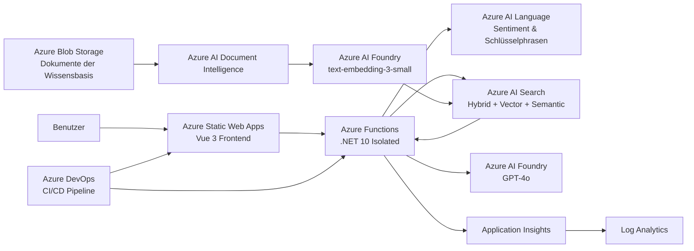

# Azure Intelligent Support Assistant

[English](README.md) | [Deutsch](README.de.md) | [Русский](README.ru.md)

> Ein produktionsnaher intelligenter Kunden-Support-Assistent auf Basis von .NET, Vue 3 und Azure AI Services.

## Status

✅ Kernimplementierung abgeschlossen
✅ Deployment in Azure abgeschlossen
✅ CI/CD funktionsfähig
✅ Monitoring und Alerts konfiguriert
✅ Anwendung in Azure verfügbar

**Live-Anwendung:**
https://gentle-sand-0b9bfc703.4.azurestaticapps.net

---

## Projektübersicht

Azure Intelligent Support Assistant ist eine cloudbasierte Kundensupport-Anwendung, die Kundenfragen automatisch anhand einer unternehmensinternen Wissensbasis beantwortet.

Die Anwendung kombiniert Retrieval-Augmented Generation (RAG), semantische und vektorbasierte Suche, Dokumentverarbeitung, Sprachanalyse und generative KI.

Die wichtigsten Anwendungsfälle sind:

- automatische Beantwortung häufig gestellter Kundenfragen;
- Suche nach Informationen in internen Unternehmensdokumenten;
- Generierung von Antworten auf Basis gefundener Quellen;
- Analyse von Kundennachrichten;
- Erkennung von Fällen, die an einen menschlichen Support-Mitarbeiter eskaliert werden sollen;
- Anzeige der Quelldokumente, die für die Antwortgenerierung verwendet wurden.

Das Projekt wurde im Rahmen einer praxisorientierten Arbeit für **Azure Developer / AI Engineer** entwickelt und verbindet Inhalte aus AZ-204 sowie AI-102 / AI-103.

---

## Hauptfunktionen

- Chat-Oberfläche für den Kundensupport
- Retrieval-Augmented Generation (RAG)
- Hybride Suche mit Azure AI Search:
  - Volltextsuche
  - Vektorsuche
  - semantisches Ranking
- Antwortgenerierung mit GPT-4o
- Embeddings mit `text-embedding-3-small`
- Verarbeitung von PDF- und anderen Dokumenten
- Sentimentanalyse und Extraktion von Schlüsselphrasen
- Deterministische Eskalationslogik
- Anzeige der Antwortquellen
- Authentifizierung über Azure Managed Identity
- Infrastructure as Code mit Bicep
- Automatisiertes CI/CD mit Azure DevOps
- Monitoring und Alerting
- Automatisierte Security-Scans

---

## Architektur



---

## RAG-Ablauf

Die Anwendung verwendet eine eigene Implementierung von Retrieval-Augmented Generation.

### Wissensimport

```text
Azure Blob Storage
        ↓
Document Intelligence
        ↓
Normalisierter Text
        ↓
Aufteilung in Text-Chunks
        ↓
text-embedding-3-small
        ↓
Azure AI Search
```

Die Dokumente werden vom Backend verarbeitet, ohne den Import-Assistenten im Azure Portal zu verwenden.

Der Importprozess umfasst:

1. Lesen der Dokumente aus Azure Blob Storage;
2. Extraktion des Dokumentinhalts mit Azure AI Document Intelligence;
3. Normalisierung des extrahierten Textes;
4. Aufteilung des Textes in Chunks;
5. Generierung von Vektor-Embeddings;
6. Speicherung der Text-Chunks und Metadaten in Azure AI Search.

Die Metadaten enthalten unter anderem Informationen über das Quelldokument und die Seitennummer.

### Antwortgenerierung

```text
Benutzerfrage
        ↓
Azure AI Language
        ↓
Azure AI Search
        ↓
Relevante Dokument-Chunks
        ↓
GPT-4o
        ↓
Quellenbasierte Antwort + Quellen
```

Die Anwendung verwendet eine hybride Suche, die Stichwortsuche, Vektorsuche und semantisches Ranking kombiniert.

Die gefundenen Dokument-Chunks werden dem Prompt-Kontext hinzugefügt, bevor die Anfrage an GPT-4o gesendet wird.

---

## Verwendete Azure-Dienste

| Dienst                         | Zweck                                                 |
| ------------------------------ | ----------------------------------------------------- |
| Azure Static Web Apps          | Hosting des Vue-Frontends                             |
| Azure Functions                | Serverless-.NET-Backend                               |
| Azure AI Foundry               | Bereitstellung von GPT-4o und Embedding-Modell        |
| Azure AI Search                | Hybride, vektorbasierte und semantische Suche         |
| Azure AI Language              | Sentimentanalyse und Extraktion von Schlüsselphrasen |
| Azure AI Document Intelligence | Extraktion von Text aus Dokumenten und PDFs           |
| Azure Blob Storage             | Speicherung der Dokumente der Wissensbasis            |
| Managed Identity               | Authentifizierung zur Laufzeit                        |
| Application Insights           | Anwendungstelemetrie                                  |
| Log Analytics                  | Zentrale Log-Analyse und KQL                          |
| Azure Monitor                  | Monitoring und Alerts                                 |
| Azure DevOps                   | CI/CD-Pipeline und Projektverwaltung                  |

---

## Backend

Das Backend wurde mit folgenden Technologien umgesetzt:

- C#
- .NET 10
- Azure Functions Isolated Worker Model
- Azure SDKs
- Clean Architecture

Haupt-API-Endpunkt:

```http
POST /api/chat
Content-Type: application/json
```

Beispielanfrage:

```json
{
  "question": "What is the warranty period?"
}
```

Beispielantwort:

```json
{
  "answer": "The warranty period for new products is 24 months.",
  "sources": [
    "warranty.pdf",
    "company-overview.pdf"
  ],
  "escalationRequired": false,
  "requestId": "..."
}
```

Zusätzliche Azure Functions:

```text
POST /api/knowledge/ingest
GET  /api/knowledge/search?q=...
```

---

## Frontend

Das Frontend verwendet:

- Vue 3
- TypeScript
- Vite
- Composition API
- Vitest

Die Benutzeroberfläche bietet:

- Eingabefeld für Chat-Nachrichten;
- Ladezustand;
- Fehleranzeige;
- Anzeige generierter Antworten;
- Anzeige der Quelldokumente;
- Anzeige des Eskalationsstatus;
- Anzeige der Request ID.

Das Production-Frontend wird über Azure Static Web Apps bereitgestellt.

---

## CI/CD

CI/CD ist mit YAML-Pipelines in Azure DevOps umgesetzt.

### Branch-Strategie

```text
feature/*
    ↓
Pull Request
    ↓
dev
    ↓
Automatisches Azure-Deployment
    ↓
main
```

Der Branch `dev` wird als Integrations- und Entwicklungsbranch verwendet und entspricht dem im ursprünglichen Projektauftrag beschriebenen Branch `develop`.

### Pull Requests

Pull Requests auf `dev` oder `main` führen ausschließlich Validierungs- und Prüfungsaufgaben aus.

Während eines Pull Requests werden **keine Azure-Ressourcen deployed**.

### Branch dev

Änderungen, die nach `dev` gemergt werden, starten automatisch:

1. Wiederherstellung der Abhängigkeiten;
2. Security-Scans;
3. Bicep-Validierung;
4. .NET-Build;
5. Unit-Tests;
6. Architekturtests;
7. Frontend-Build;
8. Frontend-Tests;
9. Veröffentlichung der Build-Artefakte;
10. Deployment der Azure Functions;
11. Vorbereitung der Azure Static Web Apps Infrastruktur;
12. Deployment des Frontends.

### Branch main

`main` ist der stabile Release-Branch.

Abgeschlossene Änderungen werden von `dev` nach `main` übernommen.

---

## Automatisierte Sicherheitsprüfungen

Die CI-Pipeline enthält:

- Secret Scanning mit Gitleaks;
- Dateisystemprüfung mit Trivy;
- Prüfung auf verwundbare `.NET`-Abhängigkeiten;
- `npm audit`;
- Bicep-Validierung;
- Build mit Behandlung von Warnungen als Fehler.

Anwendungsgeheimnisse werden nicht im Repository gespeichert.

---

## Authentifizierung und Sicherheit

Für die Authentifizierung gegenüber Azure-Diensten zur Laufzeit wird eine **User Assigned Managed Identity** verwendet.

Die Anwendung nutzt `DefaultAzureCredential` und Azure RBAC anstelle von API-Schlüsseln für die Kommunikation zwischen Azure-Diensten.

Beispiele für zugewiesene Rollen:

- Search Index Data Reader
- Search Index Data Contributor
- Search Service Contributor
- Cognitive Services OpenAI User
- Cognitive Services Language Reader
- Cognitive Services User
- Storage Data Roles

Azure DevOps authentifiziert sich gegenüber Azure über:

**Workload Identity Federation (WIF)**

Die Deployment-Pipeline benötigt kein langlebiges Azure Client Secret.

Zusätzliche Sicherheitsmaßnahmen:

- ausschließlich HTTPS;
- mindestens TLS 1.2;
- ressourcenbezogene RBAC-Zuweisungen;
- keine Secrets in Git;
- eingeschränktes CORS für die Function App;
- automatisierte Security-Scans in CI.

Die CORS-Konfiguration der Function App erlaubt nur Anfragen von der bereitgestellten Azure Static Web App.

---

## Infrastructure as Code

Die Azure-Infrastruktur wird mit Bicep beschrieben.

Wichtige Infrastrukturmodule:

```text
infra/
├── main.bicep
├── web.bicep
├── environments/
│   └── dev.parameters.json
└── modules/
    ├── core.bicep
    ├── ai.bicep
    ├── security.bicep
    ├── app.bicep
    └── budget.bicep
```

Infrastructure as Code umfasst:

- Resource Group;
- Storage Account;
- Blob Container;
- Azure AI Search;
- Azure AI Foundry;
- AI-Modell-Deployments;
- Document Intelligence;
- Managed Identity;
- RBAC-Zuweisungen;
- Function App;
- Flex Consumption Hosting Plan;
- Log Analytics;
- Application Insights;
- Budget Alerts.

Die Azure Static Web App wird separat über `web.bicep` verwaltet.

---

## Monitoring und Observability

Das Monitoring ist nach folgendem Schema aufgebaut:

```text
Azure Functions
      ↓
Application Insights
      ↓
Log Analytics
      ↓
Azure Monitor
```

Application Insights erfasst:

- Requests;
- Fehler;
- Antwortzeiten;
- Abhängigkeiten;
- Anwendungstelemetrie.

Log Analytics wird zur Analyse mit KQL verwendet.

Beispiel für eine KQL-Abfrage:

```kusto
AppRequests
| where TimeGenerated > ago(30m)
| project TimeGenerated, Name, ResultCode, DurationMs
| order by TimeGenerated desc
```

---

## Alerts

In Azure Monitor sind drei zentrale Alert-Regeln konfiguriert, die für das Projekt erforderlich sind.

### Fehlerrate

Der Alert wird ausgelöst, wenn die Fehlerrate höher ist als:

```text
5%
```

### Antwortzeit

Der Alert wird ausgelöst, wenn die durchschnittliche Antwortzeit höher ist als:

```text
3 Sekunden
```

### Azure OpenAI Token-Nutzung

Der Alert wird ausgelöst, wenn die Token-Nutzung ungefähr folgenden Wert überschreitet:

```text
80% des konfigurierten Limits von 10K Tokens pro Minute
```

Benachrichtigungen werden über eine Azure Monitor Action Group versendet.

---

## Monitoring-Dashboard

Das Azure Dashboard enthält wichtige Betriebskennzahlen des Projekts:

- Anzahl der Server-Requests;
- Anzahl erfolgreicher Requests;
- durchschnittliche Server-Antwortzeit;
- Azure-Projektkosten.

Das Dashboard dient als kompakter Überblick über den Systemzustand und kann unter anderem während der Projektdemonstration verwendet werden.

---

## Kostenkontrolle

Kostenkontrolle ist ein fester Bestandteil der Projektinfrastruktur.

Es ist ein monatlicher Azure Budget Alert konfiguriert:

```text
€30 / Monat
```

Die Entwicklungsumgebung verwendet überwiegend kostenlose oder verbrauchsbasierte Azure-Dienste.

Für die Resource Group des Projekts wurde in Azure Cost Management eine Ansicht mit Gruppierung nach Azure-Dienst eingerichtet.

Zum Zeitpunkt der finalen Projektprüfung lagen die bisher angefallenen Kosten der Entwicklungsumgebung bei ungefähr:

```text
US$0.15
```

Der größte Anteil der gemessenen Kosten entfiel auf Azure AI / Foundry Services.

Dieser Wert stellt nur eine Momentaufnahme der Entwicklungskosten dar und ist keine Prognose für die Betriebskosten eines Produktivsystems.

---

## Tests

### Backend

Die Solution enthält:

- Unit-Tests;
- Architekturtests;
- Integrationstests.

Das Projekt enthält mehr als 150 automatisierte .NET-Tests.

Integrationstests für Szenarien mit realen Azure-Diensten werden getrennt von der regulären Pull-Request-Pipeline ausgeführt.

### Frontend

Frontend-Tests werden mit Vitest umgesetzt.

Sie decken folgende Bereiche ab:

- Darstellung des Chats;
- erfolgreiche Requests;
- Ladezustand;
- Fehlerfälle;
- Eskalationsverhalten.

---

## Lokale Entwicklung

### Voraussetzungen

- .NET 10 SDK
- Node.js 24
- Docker
- Docker Compose
- Azure CLI
- Azure Functions Core Tools

### Docker Compose

Die lokale Entwicklungsumgebung kann mit Docker Compose gestartet werden:

```bash
docker compose up --build
```

Der lokale Development Stack umfasst:

- Backend;
- Frontend;
- Azurite;
- WireMock.

Für die lokale Azure-Authentifizierung werden Umgebungsvariablen aus einer lokalen `.env`-Datei verwendet.

Beispiele für Variablennamen:

```text
AZURE_TENANT_ID
AZURE_CLIENT_ID
AZURE_CLIENT_SECRET
```

Die `.env`-Datei wird von Git ausgeschlossen und darf niemals in das Repository committed werden.

---

## Repository-Struktur

```text
.
├── infra/
│   ├── environments/
│   ├── modules/
│   ├── main.bicep
│   └── web.bicep
│
├── pipelines/
│   └── pr-ci.yml
│
├── src/
│   ├── SupportAssistant.Api/
│   ├── SupportAssistant.Application/
│   ├── SupportAssistant.Domain/
│   ├── SupportAssistant.Infrastructure/
│   ├── SupportAssistant.UnitTests/
│   ├── SupportAssistant.IntegrationTests/
│   ├── SupportAssistant.ArchitectureTests/
│   └── SupportAssistant.Web/
│
├── docker-compose.yml
└── README.md
```

---

## Deployment

Das Deployment nach Azure erfolgt über Azure DevOps.

Die Pipeline verwendet folgende Azure Resource Manager Service Connection:

```text
sc-isa-dev-wif
```

Zur Authentifizierung wird Workload Identity Federation verwendet.

Zielplattform für das Backend:

```text
Azure Functions
Flex Consumption
.NET 10 isolated
```

Zielplattform für das Frontend:

```text
Azure Static Web Apps
Free Tier
```

---

## Bekannte Einschränkungen

Die aktuelle Implementierung ist für eine Entwicklungs- und Demo-Umgebung vorgesehen und nicht für eine vollständig produktive Kundensupport-Plattform.

Bekannte Einschränkungen:

- derzeit ist nur eine Azure-Umgebung deployed;
- `dev` wird gleichzeitig als Entwicklungs- und Demo-Umgebung verwendet;
- Azure AI Search erlaubt aktuell sowohl Microsoft Entra ID als auch API-Key-Authentifizierung, obwohl der Runtime-Zugriff über Managed Identity erfolgt;
- die Monitoring-Konfiguration ist bewusst kompakt gehalten;
- Last- und Stresstests liegen außerhalb des Projektumfangs;
- erweiterte produktive Netzwerkkonzepte wie Private Endpoints sind nicht implementiert.

---

## Projektziele

Das Projekt demonstriert praktische Erfahrung mit:

- Azure-Anwendungsentwicklung;
- Integration von Azure AI;
- Retrieval-Augmented Generation;
- Azure Functions;
- Azure Identity und RBAC;
- Infrastructure as Code;
- Azure DevOps CI/CD;
- automatisierten Tests;
- Security Scanning;
- Monitoring und Observability;
- Cloud-Kostenmanagement.

---

## Lizenz

Dieses Repository wurde als Lern- und Ausbildungsprojekt erstellt.

Das im Projekt verwendete Beispielunternehmen sowie die Daten der Wissensbasis sind vollständig fikti

🚧 In Entwicklung

## Geplanter Technologie-Stack

- C# / .NET
- Azure Functions
- Vue 3 / TypeScript
- Azure OpenAI
- Azure AI Search
- Azure AI Language
- Azure AI Document Intelligence
- Azure Blob Storage
- Docker / Docker Compose
- Bicep
- Azure DevOps
