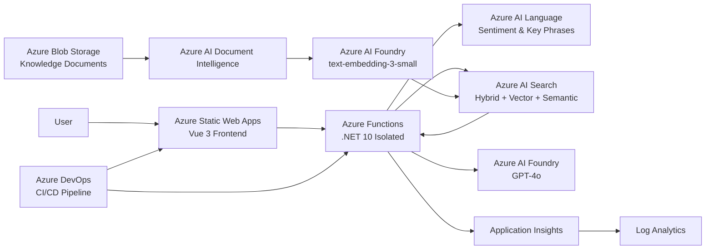

# Azure Intelligent Support Assistant

[English](README.md) | [Deutsch](README.de.md) | [Русский](README.ru.md)

> A production-style intelligent customer support assistant built with .NET, Vue 3 and Azure AI services.

## Status

✅ Core implementation completed
✅ Azure deployment completed
✅ CI/CD operational
✅ Monitoring and alerting configured
✅ Application available in Azure

**Live application:**
https://gentle-sand-0b9bfc703.4.azurestaticapps.net

---

## Project Overview

Azure Intelligent Support Assistant is a cloud-based customer support application that automatically answers customer questions using company-specific knowledge.

The application combines Retrieval-Augmented Generation (RAG), semantic and vector search, document processing, language analysis and generative AI.

The main use cases are:

- answer frequently asked customer questions;
- retrieve information from company documents;
- generate grounded answers based on retrieved sources;
- analyze customer messages;
- identify cases that should be escalated to human support;
- display the source documents used to generate an answer.

The project was developed as part of the **Azure Developer / AI Engineer practical project**, combining concepts from AZ-204 and AI-102 / AI-103.

---

## Main Features

- Customer support chat interface
- Retrieval-Augmented Generation (RAG)
- Hybrid Azure AI Search
  - full-text search
  - vector search
  - semantic ranking
- GPT-4o answer generation
- `text-embedding-3-small` embeddings
- PDF and document processing
- Sentiment and key phrase analysis
- Deterministic escalation logic
- Source attribution
- Azure Managed Identity authentication
- Infrastructure as Code with Bicep
- Automated CI/CD with Azure DevOps
- Application monitoring and alerting
- Automated security scans

---

## Architecture



---

## RAG Flow

The application uses a custom Retrieval-Augmented Generation pipeline.

### Knowledge ingestion

```text
Azure Blob Storage
        ↓
Document Intelligence
        ↓
Normalized text
        ↓
Text chunking
        ↓
text-embedding-3-small
        ↓
Azure AI Search
```

Documents are processed by the backend instead of relying on the Azure portal import wizard.

The ingestion pipeline:

1. reads documents from Azure Blob Storage;
2. extracts document content with Azure AI Document Intelligence;
3. normalizes the extracted text;
4. splits the text into chunks;
5. generates vector embeddings;
6. stores chunks and metadata in Azure AI Search.

Metadata includes information such as source document and page number.

### Question answering

```text
User question
      ↓
Azure AI Language
      ↓
Azure AI Search
      ↓
Relevant document chunks
      ↓
GPT-4o
      ↓
Grounded answer + sources
```

The application uses hybrid retrieval combining keyword, vector and semantic search.

The retrieved document chunks are added to the prompt context before the request is sent to GPT-4o.

---

## Azure Services

| Service                        | Purpose                                |
| ------------------------------ | -------------------------------------- |
| Azure Static Web Apps          | Vue frontend hosting                   |
| Azure Functions                | Serverless .NET backend                |
| Azure AI Foundry               | GPT-4o and embedding model deployments |
| Azure AI Search                | Hybrid, vector and semantic retrieval  |
| Azure AI Language              | Sentiment and key phrase analysis      |
| Azure AI Document Intelligence | Document and PDF text extraction       |
| Azure Blob Storage             | Knowledge Base document storage        |
| Managed Identity               | Runtime authentication                 |
| Application Insights           | Application telemetry                  |
| Log Analytics                  | Centralized log analysis and KQL       |
| Azure Monitor                  | Alerts and monitoring                  |
| Azure DevOps                   | CI/CD pipeline and project management  |

---

## Backend

The backend is implemented using:

- C#
- .NET 10
- Azure Functions isolated worker model
- Azure SDKs
- Clean Architecture

Main API endpoint:

```http
POST /api/chat
Content-Type: application/json
```

Example request:

```json
{
  "question": "What is the warranty period?"
}
```

Example response:

```json
{
  "answer": "The warranty period for new products is 24 months.",
  "sources": [
    "warranty.pdf",
    "company-overview.pdf"
  ],
  "escalationRequired": false,
  "requestId": "..."
}
```

Additional backend functions include:

```text
POST /api/knowledge/ingest
GET  /api/knowledge/search?q=...
```

---

## Frontend

The frontend uses:

- Vue 3
- TypeScript
- Vite
- Composition API
- Vitest

The UI provides:

- chat message input;
- loading state;
- error state;
- generated answers;
- source document display;
- escalation indication;
- request ID display.

The production frontend is hosted using Azure Static Web Apps.

---

## CI/CD

CI/CD is implemented using Azure DevOps YAML pipelines.

### Branch strategy

```text
feature/*
    ↓
Pull Request
    ↓
dev
    ↓
Automated Azure deployment
    ↓
main
```

The `dev` branch is used as the integration/development branch and corresponds to the `develop` branch described in the project assignment.

### Pull Requests

Pull Requests targeting `dev` or `main` execute validation only.

They do **not** deploy Azure resources.

### dev branch

Changes merged into `dev` automatically execute:

1. dependency restore;
2. security scans;
3. Bicep validation;
4. .NET build;
5. unit tests;
6. architecture tests;
7. frontend build;
8. frontend tests;
9. artifact publication;
10. Azure Functions deployment;
11. Static Web Apps infrastructure preparation;
12. frontend deployment.

### main branch

`main` is the stable release branch.

Finalized changes are promoted from `dev` to `main`.

---

## Automated Security Checks

The CI pipeline includes:

- Gitleaks secret scanning;
- Trivy filesystem scanning;
- `.NET` vulnerable dependency scanning;
- `npm audit`;
- Bicep validation;
- build with warnings treated as errors.

No application secrets are stored in the repository.

---

## Authentication and Security

Runtime Azure authentication uses a **User Assigned Managed Identity**.

The application uses `DefaultAzureCredential` and Azure RBAC instead of API keys for service-to-service authentication.

Examples of assigned permissions include:

- Search Index Data Reader
- Search Index Data Contributor
- Search Service Contributor
- Cognitive Services OpenAI User
- Cognitive Services Language Reader
- Cognitive Services User
- Storage data roles

Azure DevOps authenticates to Azure using:

**Workload Identity Federation (WIF)**

No long-lived Azure client secret is required by the deployment pipeline.

Additional security measures include:

- HTTPS only;
- TLS 1.2 minimum;
- resource-scoped RBAC;
- no secrets committed to Git;
- restricted Function App CORS;
- security scanning during CI.

The Function App CORS configuration only allows the deployed Azure Static Web App origin.

---

## Infrastructure as Code

Azure infrastructure is defined using Bicep.

Main infrastructure modules include:

```text
infra/
├── main.bicep
├── web.bicep
├── environments/
│   └── dev.parameters.json
└── modules/
    ├── core.bicep
    ├── ai.bicep
    ├── security.bicep
    ├── app.bicep
    └── budget.bicep
```

The infrastructure includes:

- Resource Group;
- Storage Account;
- Blob containers;
- Azure AI Search;
- Azure AI Foundry;
- AI model deployments;
- Document Intelligence;
- Managed Identity;
- RBAC assignments;
- Function App;
- Flex Consumption hosting plan;
- Log Analytics;
- Application Insights;
- Budget alerts.

The Static Web App is managed separately by `web.bicep`.

---

## Monitoring and Observability

Monitoring is implemented using:

```text
Azure Functions
      ↓
Application Insights
      ↓
Log Analytics
      ↓
Azure Monitor
```

Application Insights collects:

- requests;
- failures;
- response times;
- dependencies;
- application telemetry.

Log Analytics is used for KQL-based analysis.

Example KQL query:

```kusto
AppRequests
| where TimeGenerated > ago(30m)
| project TimeGenerated, Name, ResultCode, DurationMs
| order by TimeGenerated desc
```

---

## Alerts

Azure Monitor contains three main alert rules required by the project.

### Error rate

Triggers when the application error rate exceeds:

```text
5%
```

### Response time

Triggers when average response time exceeds:

```text
3 seconds
```

### Azure OpenAI token usage

Triggers when token usage exceeds approximately:

```text
80% of the configured 10K token-per-minute limit
```

Alert notifications are delivered through an Azure Monitor Action Group.

---

## Monitoring Dashboard

The Azure Dashboard contains operational project metrics including:

- server requests;
- successful requests;
- average server response time;
- Azure project costs.

The dashboard is intended to provide a compact operational overview during the project demonstration.

---

## Cost Control

Cost control is an explicit part of the infrastructure.

A monthly Azure Budget Alert is configured for:

```text
€30 / month
```

The development environment primarily uses free or consumption-based Azure services.

A Cost Management view is configured for the project Resource Group and grouped by Azure service.

At the time of the final project review, the accumulated development cost was approximately:

```text
US$0.15
```

The majority of the measured cost was associated with Azure AI / Foundry services.

This value is only a point-in-time development snapshot and not a prediction of production operating costs.

---

## Testing

### Backend

The solution contains:

- unit tests;
- architecture tests;
- integration tests.

The project has more than 150 automated .NET tests.

Integration tests cover real Azure-backed scenarios separately from the standard Pull Request pipeline.

### Frontend

Frontend tests are implemented using Vitest.

They cover:

- chat rendering;
- successful requests;
- loading state;
- errors;
- escalation behaviour.

---

## Local Development

### Requirements

- .NET 10 SDK
- Node.js 24
- Docker
- Docker Compose
- Azure CLI
- Azure Functions Core Tools

### Docker Compose

The local environment can run using Docker Compose:

```bash
docker compose up --build
```

The development stack includes:

- backend;
- frontend;
- Azurite;
- WireMock.

Local Azure authentication can be provided through environment variables in a local `.env` file.

Example variable names:

```text
AZURE_TENANT_ID
AZURE_CLIENT_ID
AZURE_CLIENT_SECRET
```

The `.env` file is excluded from Git and must never be committed.

---

## Repository Structure

```text
.
├── infra/
│   ├── environments/
│   ├── modules/
│   ├── main.bicep
│   └── web.bicep
│
├── pipelines/
│   └── pr-ci.yml
│
├── src/
│   ├── SupportAssistant.Api/
│   ├── SupportAssistant.Application/
│   ├── SupportAssistant.Domain/
│   ├── SupportAssistant.Infrastructure/
│   ├── SupportAssistant.UnitTests/
│   ├── SupportAssistant.IntegrationTests/
│   ├── SupportAssistant.ArchitectureTests/
│   └── SupportAssistant.Web/
│
├── docker-compose.yml
└── README.md
```

---

## Deployment

Azure deployment is performed through Azure DevOps.

The pipeline uses the Azure Resource Manager service connection:

```text
sc-isa-dev-wif
```

Authentication uses Workload Identity Federation.

Backend deployment target:

```text
Azure Functions
Flex Consumption
.NET 10 isolated
```

Frontend deployment target:

```text
Azure Static Web Apps
Free tier
```

---

## Known Limitations

The current implementation is designed as a development/demo environment rather than a production customer support platform.

Known limitations include:

- only one Azure environment is currently deployed;
- `dev` is used as both development and demonstration environment;
- Azure AI Search currently permits both Microsoft Entra ID and API-key authentication, although runtime access uses Managed Identity;
- monitoring configuration is intentionally compact;
- load and stress testing are outside the project scope;
- advanced production networking such as Private Endpoints is not implemented.

---

## Project Goals

This project demonstrates practical experience with:

- Azure application development;
- Azure AI integration;
- Retrieval-Augmented Generation;
- Azure Functions;
- Azure identity and RBAC;
- Infrastructure as Code;
- Azure DevOps CI/CD;
- automated testing;
- security scanning;
- monitoring and observability;
- cloud cost management.

---

## License

This repository was created as an educational project.

The sample company and knowledge-base data used by the application are fictiona

🚧 In development

## Planned Technology Stack

- C# / .NET
- Azure Functions
- Vue 3 / TypeScript
- Azure OpenAI
- Azure AI Search
- Azure AI Language
- Azure AI Document Intelligence
- Azure Blob Storage
- Docker / Docker Compose
- Bicep
- Azure DevOps
