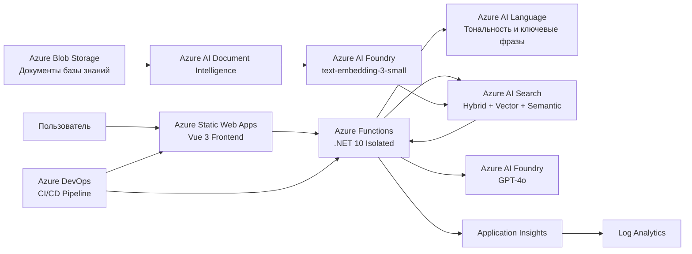

# Azure Intelligent Support Assistant

[English](README.md) | [Deutsch](README.de.md) | [Русский](README.ru.md)

> Production-style интеллектуальный ассистент клиентской поддержки на основе .NET, Vue 3 и Azure AI Services.

## Статус

✅ Основная реализация завершена
✅ Развёртывание в Azure завершено
✅ CI/CD работает
✅ Мониторинг и оповещения настроены
✅ Приложение доступно в Azure

**Рабочее приложение:**
https://gentle-sand-0b9bfc703.4.azurestaticapps.net

---

## Обзор проекта

Azure Intelligent Support Assistant — облачное приложение службы поддержки, которое автоматически отвечает на вопросы клиентов, используя внутреннюю базу знаний компании.

Приложение объединяет Retrieval-Augmented Generation (RAG), семантический и векторный поиск, обработку документов, анализ языка и генеративный искусственный интеллект.

Основные сценарии использования:

- автоматические ответы на часто задаваемые вопросы клиентов;
- поиск информации во внутренних документах компании;
- генерация ответов на основе найденных источников;
- анализ сообщений клиентов;
- определение обращений, которые необходимо передать сотруднику службы поддержки;
- отображение документов-источников, использованных при генерации ответа.

Проект разработан в рамках практической работы по направлениям **Azure Developer / AI Engineer**, объединяющей темы AZ-204 и AI-102 / AI-103.

---

## Основные возможности

- Интерфейс чата службы поддержки
- Retrieval-Augmented Generation (RAG)
- Гибридный поиск Azure AI Search:
  - полнотекстовый поиск
  - векторный поиск
  - семантическое ранжирование
- Генерация ответов с помощью GPT-4o
- Векторные представления `text-embedding-3-small`
- Обработка PDF и других документов
- Анализ тональности и ключевых фраз
- Детерминированная логика эскалации
- Отображение источников ответа
- Аутентификация через Azure Managed Identity
- Infrastructure as Code с использованием Bicep
- Автоматизированный CI/CD через Azure DevOps
- Мониторинг приложения и оповещения
- Автоматизированные проверки безопасности

---

## Архитектура



---

## RAG-процесс

Приложение использует собственную реализацию Retrieval-Augmented Generation.

### Загрузка базы знаний

```text
Azure Blob Storage
        ↓
Document Intelligence
        ↓
Нормализованный текст
        ↓
Разбиение текста на фрагменты
        ↓
text-embedding-3-small
        ↓
Azure AI Search
```

Документы обрабатываются backend-приложением без использования мастера импорта Azure Portal.

Процесс загрузки базы знаний:

1. чтение документов из Azure Blob Storage;
2. извлечение содержимого документов с помощью Azure AI Document Intelligence;
3. нормализация извлечённого текста;
4. разбиение текста на фрагменты;
5. генерация векторных представлений;
6. сохранение фрагментов текста и метаданных в Azure AI Search.

Метаданные содержат, среди прочего, информацию об исходном документе и номере страницы.

### Формирование ответа

```text
Вопрос пользователя
        ↓
Azure AI Language
        ↓
Azure AI Search
        ↓
Релевантные фрагменты документов
        ↓
GPT-4o
        ↓
Ответ на основе источников + ссылки на источники
```

Приложение использует гибридный поиск, объединяющий ключевые слова, векторный поиск и семантическое ранжирование.

Найденные фрагменты документов добавляются в контекст запроса перед отправкой запроса в GPT-4o.

---

## Используемые сервисы Azure

| Сервис                   | Назначение                                                                   |
| ------------------------------ | -------------------------------------------------------------------------------------- |
| Azure Static Web Apps          | Хостинг Vue frontend                                                            |
| Azure Functions                | Serverless backend на .NET                                                           |
| Azure AI Foundry               | Развёртывания GPT-4o и embedding-модели                            |
| Azure AI Search                | Гибридный, векторный и семантический поиск        |
| Azure AI Language              | Анализ тональности и ключевых фраз                       |
| Azure AI Document Intelligence | Извлечение текста из документов и PDF                     |
| Azure Blob Storage             | Хранение документов базы знаний                            |
| Managed Identity               | Аутентификация приложения во время выполнения |
| Application Insights           | Телеметрия приложения                                              |
| Log Analytics                  | Централизованный анализ логов и KQL                        |
| Azure Monitor                  | Мониторинг и оповещения                                           |
| Azure DevOps                   | CI/CD pipeline и управление проектом                                |

---

## Backend

Backend реализован с использованием:

- C#
- .NET 10
- Azure Functions isolated worker model
- Azure SDK
- Clean Architecture

Основной API endpoint:

```http
POST /api/chat
Content-Type: application/json
```

Пример запроса:

```json
{
  "question": "What is the warranty period?"
}
```

Пример ответа:

```json
{
  "answer": "The warranty period for new products is 24 months.",
  "sources": [
    "warranty.pdf",
    "company-overview.pdf"
  ],
  "escalationRequired": false,
  "requestId": "..."
}
```

Дополнительные Azure Functions:

```text
POST /api/knowledge/ingest
GET  /api/knowledge/search?q=...
```

---

## Frontend

Frontend использует:

- Vue 3
- TypeScript
- Vite
- Composition API
- Vitest

Пользовательский интерфейс предоставляет:

- поле ввода сообщений;
- состояние загрузки;
- отображение ошибок;
- отображение сгенерированных ответов;
- отображение документов-источников;
- отображение признака эскалации;
- отображение Request ID.

Production frontend размещён в Azure Static Web Apps.

---

## CI/CD

CI/CD реализован с помощью YAML-pipeline в Azure DevOps.

### Стратегия веток

```text
feature/*
    ↓
Pull Request
    ↓
dev
    ↓
Автоматическое развёртывание в Azure
    ↓
main
```

Ветка `dev` используется как интеграционная и development-ветка и соответствует ветке `develop`, указанной в исходном задании проекта.

### Pull Requests

Pull Request в `dev` или `main` запускает только проверки.

Во время Pull Request **развёртывание ресурсов Azure не выполняется**.

### Ветка dev

Изменения, объединённые с `dev`, автоматически запускают:

1. восстановление зависимостей;
2. проверки безопасности;
3. проверку Bicep;
4. сборку .NET;
5. unit-тесты;
6. архитектурные тесты;
7. сборку frontend;
8. frontend-тесты;
9. публикацию артефактов;
10. развёртывание Azure Functions;
11. подготовку инфраструктуры Azure Static Web Apps;
12. развёртывание frontend.

### Ветка main

`main` является стабильной release-веткой.

Завершённые изменения переносятся из `dev` в `main`.

---

## Автоматизированные проверки безопасности

CI pipeline содержит:

- поиск секретов с помощью Gitleaks;
- проверку файловой системы с помощью Trivy;
- проверку уязвимых `.NET`-зависимостей;
- `npm audit`;
- проверку Bicep;
- сборку с преобразованием предупреждений в ошибки.

Секреты приложения не хранятся в репозитории.

---

## Аутентификация и безопасность

Для аутентификации Azure-сервисов во время выполнения используется **User Assigned Managed Identity**.

Приложение использует `DefaultAzureCredential` и Azure RBAC вместо API-ключей для взаимодействия между Azure-сервисами.

Примеры назначенных ролей:

- Search Index Data Reader
- Search Index Data Contributor
- Search Service Contributor
- Cognitive Services OpenAI User
- Cognitive Services Language Reader
- Cognitive Services User
- Storage data roles

Azure DevOps аутентифицируется в Azure с помощью:

**Workload Identity Federation (WIF)**

Pipeline развёртывания не требует долгоживущего Azure Client Secret.

Дополнительные меры безопасности:

- использование только HTTPS;
- минимум TLS 1.2;
- RBAC на уровне конкретных ресурсов;
- отсутствие секретов в Git;
- ограниченный CORS для Function App;
- автоматические security scans в CI.

CORS Function App разрешает запросы только от развёрнутого Azure Static Web App.

---

## Infrastructure as Code

Инфраструктура Azure описана с помощью Bicep.

Основные инфраструктурные модули:

```text
infra/
├── main.bicep
├── web.bicep
├── environments/
│   └── dev.parameters.json
└── modules/
    ├── core.bicep
    ├── ai.bicep
    ├── security.bicep
    ├── app.bicep
    └── budget.bicep
```

Infrastructure as Code включает:

- Resource Group;
- Storage Account;
- Blob containers;
- Azure AI Search;
- Azure AI Foundry;
- развёртывания AI-моделей;
- Document Intelligence;
- Managed Identity;
- RBAC assignments;
- Function App;
- Flex Consumption hosting plan;
- Log Analytics;
- Application Insights;
- Budget Alerts.

Azure Static Web App управляется отдельно через `web.bicep`.

---

## Мониторинг и наблюдаемость

Мониторинг реализован по следующей схеме:

```text
Azure Functions
      ↓
Application Insights
      ↓
Log Analytics
      ↓
Azure Monitor
```

Application Insights собирает:

- запросы;
- ошибки;
- время ответа;
- зависимости;
- телеметрию приложения.

Log Analytics используется для анализа данных с помощью KQL.

Пример KQL-запроса:

```kusto
AppRequests
| where TimeGenerated > ago(30m)
| project TimeGenerated, Name, ResultCode, DurationMs
| order by TimeGenerated desc
```

---

## Оповещения

В Azure Monitor настроены три основных правила оповещений, требуемые проектом.

### Частота ошибок

Оповещение срабатывает, когда частота ошибок превышает:

```text
5%
```

### Время ответа

Оповещение срабатывает, когда среднее время ответа превышает:

```text
3 секунды
```

### Использование токенов Azure OpenAI

Оповещение срабатывает, когда использование токенов превышает примерно:

```text
80% от настроенного лимита 10K токенов в минуту
```

Уведомления отправляются через Azure Monitor Action Group.

---

## Dashboard мониторинга

Azure Dashboard содержит основные эксплуатационные показатели проекта:

- количество запросов к серверу;
- количество успешных запросов;
- среднее время ответа сервера;
- расходы Azure-проекта.

Dashboard предназначен для быстрого обзора состояния системы, в том числе во время демонстрации проекта.

---

## Контроль расходов

Контроль расходов является частью инфраструктуры проекта.

Настроен ежемесячный Azure Budget Alert:

```text
€30 / месяц
```

Development-окружение преимущественно использует бесплатные или consumption-based сервисы Azure.

Для Resource Group проекта настроено представление Cost Management с группировкой по Azure-сервисам.

На момент финальной проверки проекта накопленные расходы development-окружения составляли приблизительно:

```text
US$0.15
```

Основная часть измеренных расходов приходилась на Azure AI / Foundry services.

Это значение отражает только расходы на конкретный момент времени во время разработки и не является прогнозом стоимости эксплуатации production-системы.

---

## Тестирование

### Backend

Solution содержит:

- unit-тесты;
- архитектурные тесты;
- integration-тесты.

Проект содержит более 150 автоматизированных .NET-тестов.

Integration tests для сценариев с реальными Azure-сервисами запускаются отдельно от стандартного Pull Request pipeline.

### Frontend

Frontend-тесты реализованы с помощью Vitest.

Они покрывают:

- отображение чата;
- успешные запросы;
- состояние загрузки;
- ошибки;
- поведение эскалации.

---

## Локальная разработка

### Требования

- .NET 10 SDK
- Node.js 24
- Docker
- Docker Compose
- Azure CLI
- Azure Functions Core Tools

### Docker Compose

Локальное окружение может запускаться через Docker Compose:

```bash
docker compose up --build
```

Development stack включает:

- backend;
- frontend;
- Azurite;
- WireMock.

Для локальной аутентификации Azure используются переменные окружения из локального файла `.env`.

Примеры имён переменных:

```text
AZURE_TENANT_ID
AZURE_CLIENT_ID
AZURE_CLIENT_SECRET
```

Файл `.env` исключён из Git и никогда не должен попадать в репозиторий.

---

## Структура репозитория

```text
.
├── infra/
│   ├── environments/
│   ├── modules/
│   ├── main.bicep
│   └── web.bicep
│
├── pipelines/
│   └── pr-ci.yml
│
├── src/
│   ├── SupportAssistant.Api/
│   ├── SupportAssistant.Application/
│   ├── SupportAssistant.Domain/
│   ├── SupportAssistant.Infrastructure/
│   ├── SupportAssistant.UnitTests/
│   ├── SupportAssistant.IntegrationTests/
│   ├── SupportAssistant.ArchitectureTests/
│   └── SupportAssistant.Web/
│
├── docker-compose.yml
└── README.md
```

---

## Развёртывание

Развёртывание в Azure выполняется через Azure DevOps.

Pipeline использует Azure Resource Manager Service Connection:

```text
sc-isa-dev-wif
```

Для аутентификации используется Workload Identity Federation.

Целевая платформа backend:

```text
Azure Functions
Flex Consumption
.NET 10 isolated
```

Целевая платформа frontend:

```text
Azure Static Web Apps
Free tier
```

---

## Известные ограничения

Текущая реализация предназначена для development/demo-окружения, а не для полноценной production-системы поддержки клиентов.

Известные ограничения:

- в Azure развёрнуто только одно окружение;
- `dev` используется одновременно как development- и demonstration-окружение;
- Azure AI Search разрешает как Microsoft Entra ID, так и аутентификацию по API-ключам, хотя приложение во время выполнения использует Managed Identity;
- конфигурация мониторинга намеренно оставлена компактной;
- нагрузочное и стресс-тестирование не входит в объём проекта;
- расширенные production-сетевые механизмы, например Private Endpoints, не реализованы.

---

## Цели проекта

Проект демонстрирует практический опыт работы с:

- разработкой приложений для Azure;
- интеграцией Azure AI;
- Retrieval-Augmented Generation;
- Azure Functions;
- Azure Identity и RBAC;
- Infrastructure as Code;
- Azure DevOps CI/CD;
- автоматизированным тестированием;
- security scanning;
- мониторингом и наблюдаемостью;
- управлением расходами в облаке.

---

## Лицензия

Репозиторий создан как учебный проект.

Используемая в приложении тестовая компания и данные базы знаний являются вымышленным

🚧 В разработке

## Планируемый стек технологий

- C# / .NET
- Azure Functions
- Vue 3 / TypeScript
- Azure OpenAI
- Azure AI Search
- Azure AI Language
- Azure AI Document Intelligence
- Azure Blob Storage
- Docker / Docker Compose
- Bicep
- Azure DevOps
