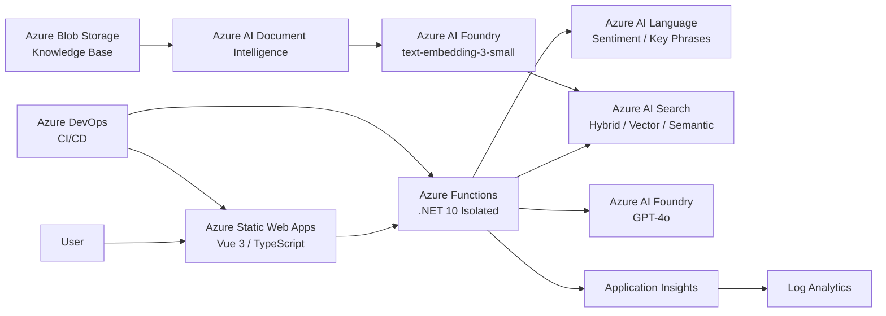

# Technical Documentation

## Azure Intelligent Support Assistant

**Project:** Intelligent Customer Support Assistant
**Technologies:** .NET 10, Vue 3, Azure Functions, Azure AI Services, Azure DevOps
**Cloud Platform:** Microsoft Azure
**Environment:** Development / Demo
**Primary Resource Region:** Germany West Central

---

## 1. Purpose and Technical Scope

Azure Intelligent Support Assistant is a cloud-based application for automated processing of recurring customer inquiries.

The system does not answer questions solely based on the general knowledge of a language model. Instead, it uses a company-specific knowledge base. Relevant information is first retrieved using Azure AI Search and then passed to GPT-4o as context.

This implements a Retrieval-Augmented Generation (RAG) approach.

The application supports the following main technical scenarios:

- processing customer questions in natural language;
- retrieving relevant information from a document-based knowledge base;
- hybrid search combining text, vector, and semantic search;
- generating answers with GPT-4o;
- returning the source documents used for the answer;
- analyzing customer requests with Azure AI Language;
- determining whether escalation is required;
- automated deployment through Azure DevOps;
- monitoring, alerting, and cost control.

The current implementation represents a complete Development/Demo environment. It is not a fully hardened production platform.

---

## 2. Deployed Application

The frontend is publicly available through Azure Static Web Apps:

```text
https://gentle-sand-0b9bfc703.4.azurestaticapps.net
```

The frontend communicates with an Azure Function App.

The primary API endpoint is:

```http
POST /api/chat
```

Example request:

```json
{
  "question": "What is the warranty period?"
}
```

A successful request returns, for example:

```json
{
  "answer": "The warranty period for SVoy Electronics products is 24 months.",
  "sources": [
    "warranty.pdf",
    "company-overview.pdf"
  ],
  "escalationRequired": false,
  "requestId": "..."
}
```

In addition to the generated answer, the frontend receives source information, the escalation status, and a Request ID.

---

## 3. Solution Architecture

The application separates the user interface, backend, AI services, knowledge storage, monitoring, and deployment processes.



The frontend contains no direct AI or data-access logic. Orchestration of Azure services is performed by the .NET backend.

---

## 4. Backend Architecture

The backend is based on:

- C#;
- .NET 10;
- Azure Functions;
- .NET Isolated Worker Model;
- Azure SDKs.

The source code is separated into multiple areas of responsibility:

```text
SupportAssistant.Api
SupportAssistant.Application
SupportAssistant.Domain
SupportAssistant.Infrastructure
```

Separate test projects are also included:

```text
SupportAssistant.UnitTests
SupportAssistant.IntegrationTests
SupportAssistant.ArchitectureTests
```

This separation reduces direct coupling between business logic, Azure-specific infrastructure, and the API layer.

Azure Functions are responsible for tasks including:

- HTTP request handling;
- validation of incoming requests;
- AI Language calls;
- retrieval through Azure AI Search;
- building the model context;
- GPT calls;
- determining answer sources;
- escalation logic;
- telemetry.

---

## 5. Knowledge Base Processing

The knowledge base consists of documents stored in Azure Blob Storage.

Data preparation is performed through a custom .NET-based ingestion pipeline rather than through a manually configured import process in the Azure Portal.

The process is:

```text
Document
   ↓
Azure Blob Storage
   ↓
Azure AI Document Intelligence
   ↓
Text Extraction
   ↓
Normalization
   ↓
Chunking
   ↓
text-embedding-3-small
   ↓
Azure AI Search
```

### 5.1 Document Content Extraction

Azure AI Document Intelligence extracts the textual content from the provided documents.

The extracted text is then normalized in the backend.

### 5.2 Chunking

Large documents are not stored as a single object.

The text is split into smaller chunks so that only the actually relevant document sections need to be passed into the prompt during retrieval.

### 5.3 Embeddings

For each chunk, a vector is generated using the following model:

```text
text-embedding-3-small
```

This vector represents the semantic content of the corresponding text section.

### 5.4 Indexing

The text, vector, and metadata are then stored in Azure AI Search.

The metadata includes, among other information, the original source document.

---

## 6. Retrieval and RAG

When a customer question is received, the system first searches the knowledge base.

The search configuration combines multiple approaches:

- traditional text search;
- vector search;
- semantic search.

An HNSW-based index is used for vector search.

A Semantic Configuration is also configured:

```text
semantic-config
```

The request processing flow can be simplified as follows:

```text
User question
    ↓
Azure AI Search
    ↓
Hybrid Retrieval
    ↓
relevant document chunks
    ↓
Prompt Context
    ↓
GPT-4o
    ↓
Answer + sources
```

The application therefore does not rely exclusively on vector search.

Hybrid Search allows both exact term matches and semantically similar formulations to be considered.

---

## 7. Generative AI

The following model is used through Azure AI Foundry for answer generation:

```text
GPT-4o
```

The language model receives:

1. the user's question;
2. previously retrieved relevant document chunks;
3. corresponding system and prompt instructions.

This causes the answer to be generated based on the provided knowledge context.

RAG reduces the risk of unsupported answers but cannot technically eliminate language model hallucinations completely.

For this reason, the frontend also receives information about the source documents used to generate the answer.

---

## 8. Customer Request Analysis

Azure AI Language is used in addition to generative AI.

The application can extract information from a customer request including:

- Sentiment;
- key phrases.

This information can be used by the application logic for further evaluation of the request.

The decision whether escalation is required is not delegated exclusively to the language model.

The application contains deterministic logic for this purpose and returns the result through the following field:

```json
{
  "escalationRequired": true
}
```

Actual integration with an external ticketing or CRM system is not part of the current project version.

---

## 9. Azure Resources

The active Development/Demo environment is located in the following Resource Group:

```text
rg-isa-dev-uxfdhanjmza7m
```

Main resources:

| Resource              | Name                           | Purpose                         |
| --------------------- | ------------------------------ | ------------------------------- |
| Azure Function App    | `func-isa-dev-uxfdhanjmza7m` | .NET backend and REST API       |
| Function Plan         | `plan-isa-dev-uxfdhanjmza7m` | Flex Consumption hosting        |
| Azure Static Web Apps | `swa-isa-dev-uxfdhanjmza7m`  | Vue frontend                    |
| Azure AI Search       | `search-isa-dev-uxfdhanj`    | RAG retrieval and index         |
| Azure AI Foundry      | `ai-isa-dev-uxfdhanj`        | Generative AI and embeddings    |
| Foundry Project       | `project-isa-dev-uxfdhanj`   | AI project                      |
| Document Intelligence | `doc-isa-dev-uxfdhanj`       | Document content extraction     |
| Storage Account       | `storageisadevuxfdhanj`      | Document and deployment storage |
| Managed Identity      | `id-isa-dev-uxfdhanj`        | Runtime identity                |
| Application Insights  | `appi-isa-dev-uxfdhanj`      | Application telemetry           |
| Log Analytics         | `log-isa-dev-uxfdhanj`       | Log and telemetry analysis      |

Most resources are located in:

```text
Germany West Central
```

Azure Static Web Apps is deployed in:

```text
West Europe
```

---

## 10. Infrastructure as Code

Azure infrastructure is managed using Bicep.

The main files are:

```text
infra/
├── main.bicep
├── web.bicep
├── environments/
│   └── dev.parameters.json
└── modules/
    ├── core.bicep
    ├── ai.bicep
    ├── security.bicep
    ├── app.bicep
    └── budget.bicep
```

### `main.bicep`

Acts as the central entry point for subscription- and resource-group-level infrastructure and orchestrates the individual modules.

### `core.bicep`

Contains core platform components including:

- Storage Account;
- Azure AI Search;
- Application Insights;
- Log Analytics.

### `ai.bicep`

Manages AI components including:

- Azure AI Foundry;
- Foundry Project;
- GPT model deployment;
- embedding model;
- Document Intelligence.

### `security.bicep`

Manages:

- User Assigned Managed Identity;
- Azure RBAC Role Assignments.

### `app.bicep`

Defines:

- Azure Functions Hosting Plan;
- Function App;
- runtime configuration;
- Azure service endpoints.

### `budget.bicep`

Manages:

- Azure Budget;
- Budget Notifications.

### `web.bicep`

Manages Azure Static Web Apps separately from the backend infrastructure.

This modular structure reduces coupling between components and simplifies infrastructure changes and reviews.

---

## 11. Security Model

### 11.1 Managed Identity

The backend application uses the following User Assigned Managed Identity:

```text
id-isa-dev-uxfdhanj
```

The application uses:

```text
DefaultAzureCredential
```

In Azure, the configured User Assigned Managed Identity is used.

The Client ID is provided to the Function App through:

```text
AZURE_CLIENT_ID
```

This means Azure Client Secrets do not need to be stored in the application source code for runtime communication.

---

## 12. Azure RBAC

Access to Azure services is controlled through Azure RBAC.

Examples of assigned roles include:

```text
Search Index Data Reader
Search Index Data Contributor
Search Service Contributor
Cognitive Services OpenAI User
Cognitive Services Language Reader
Cognitive Services User
```

Roles are assigned to the specific Azure resources where they are required.

Broad additional runtime roles that had previously been assigned at the Resource Group level were removed.

As a result, the runtime configuration follows the Principle of Least Privilege more closely than a broad permission model at the entire Resource Group scope.

---

## 13. Azure AI Search Authentication

The runtime application uses Microsoft Entra ID and Azure RBAC to access Azure AI Search.

The Search resource currently also allows local API key authentication.

This is a deliberately documented choice for the current Development/Demo environment.

A possible future hardening step would be to disable local authentication completely once all administrative and technical access paths use Entra ID exclusively.

---

## 14. Function App CORS

Browser requests to the backend are restricted to the deployed frontend.

Allowed Origin:

```text
https://gentle-sand-0b9bfc703.4.azurestaticapps.net
```

The current configuration does not contain a global wildcard origin:

```text
*
```

As a result, arbitrary websites cannot issue browser-based requests to the Function API.

---

## 15. Transport Encryption

The Function App is configured to use HTTPS.

The infrastructure uses:

```text
HTTPS only
```

and at least:

```text
TLS 1.2
```

This prevents unencrypted HTTP communication.

---

## 16. CI/CD and Branch Model

Source code and pipeline configuration are stored in the GitHub repository.

Azure DevOps uses this repository as the basis for CI/CD.

The branch model is:

```text
feature/*
    ↓
Pull Request
    ↓
dev
    ↓
automated deployment
    ↓
main
```

The branch:

```text
dev
```

serves the role of the `develop` branch described in the original project assignment.

### Pull Requests

Pull Requests targeting `dev` or `main` execute validation, builds, and tests.

No Azure deployment is performed.

### `dev`

After a successful merge into `dev`, the full CI/CD pipeline is executed.

The backend and frontend are automatically deployed to the Azure Development/Demo environment.

### `main`

`main` is the stable release branch.

The current pipeline configuration runs CI checks for this branch but does not perform an automatic Azure deployment.

Final validated changes are promoted from `dev` to `main` at the end of the project.

---

## 17. Workload Identity Federation

The Azure DevOps pipeline uses the following Azure Resource Manager Service Connection:

```text
sc-isa-dev-wif
```

Authentication is performed using:

```text
Workload Identity Federation
```

As a result, Azure DevOps does not need to store a long-lived Client Secret.

This reduces:

- secret rotation requirements;
- problems caused by secret expiration;
- the risk of accidentally exposing deployment credentials.

---

## 18. CI Pipeline

The primary CI/CD pipeline is located at:

```text
pipelines/pr-ci.yml
```

It performs steps including:

1. installing the required .NET and Node.js versions;
2. restoring .NET dependencies;
3. installing frontend dependencies;
4. dependency and vulnerability checks;
5. Gitleaks secret scanning;
6. Trivy scanning;
7. Bicep validation;
8. .NET build;
9. unit tests;
10. architecture tests;
11. frontend tests;
12. frontend build;
13. publishing test and coverage results;
14. creating deployment artifacts.

For a successful run on `dev`, the following additional steps are executed:

15. Function App deployment;
16. preparation of Static Web App configuration;
17. Vue frontend deployment.

---

## 19. Security Checks in CI

### Gitleaks

Gitleaks scans the repository for accidentally stored secrets.

These may include, for example:

- API keys;
- tokens;
- passwords;
- Client Secrets.

### Trivy

Trivy performs a security scan of files and dependencies.

### .NET Dependency Scan

.NET dependencies are checked for known vulnerable packages.

### npm audit

For frontend dependencies, the following command is executed:

```bash
npm audit
```

This ensures that automated security checks cover both backend and frontend dependencies.

---

## 20. Testing and Quality Assurance

The backend contains more than 150 automated .NET tests.

The tests are divided into three categories.

### Unit Tests

Unit Tests verify business and application logic independently of real Azure resources.

### Architecture Tests

Architecture Tests verify structural dependency rules within the .NET solution.

### Integration Tests

Integration Tests validate scenarios involving real Azure services.

They are separated from the regular Pull Request run so that real Azure resources are not used unnecessarily for every code change.

Test and coverage results are published in Azure DevOps.

---

## 21. Frontend Tests

The Vue frontend is tested using Vitest.

The tests cover areas including:

- chat rendering;
- successful API responses;
- loading states;
- error states;
- escalation behavior.

Frontend tests and build are part of the CI pipeline.

---

## 22. Monitoring Concept

The monitoring chain is:

```text
Azure Functions
    ↓
Application Insights
    ↓
Log Analytics
    ↓
Azure Monitor
```

The Function App sends telemetry through:

```text
APPLICATIONINSIGHTS_CONNECTION_STRING
```

to Application Insights.

Application Insights operates in workspace-based mode and is connected to the following Log Analytics Workspace:

```text
log-isa-dev-uxfdhanj
```

The system collects information including:

- requests;
- status codes;
- response times;
- errors;
- dependencies;
- additional application telemetry.

---

## 23. Log Analytics and KQL

Telemetry data can be analyzed centrally using KQL.

Example query for recent requests:

```kusto
AppRequests
| where TimeGenerated > ago(30m)
| project TimeGenerated, Name, ResultCode, DurationMs
| order by TimeGenerated desc
```

After monitoring was configured, a real successful `/api/chat` request was recorded in the Log Analytics Workspace.

This practically verified the complete chain:

```text
Function App
→ Application Insights
→ Log Analytics
```

---

## 24. Azure Monitor Alerts

Three main alert rules are configured for the Demo environment.

### Error Rate

The first rule monitors the proportion of failed requests.

Threshold:

```text
> 5 %
```

The calculation is based on requests stored in Log Analytics.

### Response Time

The second rule monitors the average request duration.

Threshold:

```text
> 3000 ms
```

### GPT Token Usage

The third rule monitors the Azure AI Foundry metric:

```text
TokenTransaction Count
```

for the deployment:

```text
gpt-4o
```

The configured alert threshold is:

```text
8000
```

which represents approximately 80% of the assumed 10,000-token limit for the project.

All three rules use an Azure Monitor Action Group for notifications.

---

## 25. Monitoring Dashboard

An Azure Dashboard was created for the project.

It currently includes metrics such as:

- Server Requests;
- Successful Requests;
- Average Server Response Time;
- current Azure costs.

This makes it possible to display operational technical data and costs together on one page during a demonstration.

---

## 26. Cost Monitoring

Costs are monitored through Azure Cost Management at the project Resource Group level.

Scope:

```text
rg-isa-dev-uxfdhanjmza7m
```

The analysis is grouped by Azure Service.

At the time this documentation was created, accumulated costs were approximately:

```text
US$0.15
```

Of this amount, approximately:

```text
Foundry Tools   ~ US$0.14
Foundry Models  ~ US$0.01
```

The other services in use showed no visible cost or only negligible amounts at that time.

These values represent a point-in-time snapshot of Development/Demo environment costs and are not a forecast of production operating costs.

---

## 27. Budget

A monthly Azure Budget is configured for the project:

```text
€30
```

The Budget is not a technical spending limit. It acts as an early-warning mechanism for increasing Azure costs.

Budget Notifications help detect unexpected costs early during development and demonstration.

---

## 28. Key Architecture Decisions

### 28.1 Serverless Backend

Azure Functions with Flex Consumption were selected for the backend.

The application processes individual HTTP requests and does not require a continuously running application server.

A consumption-based serverless model therefore fits the current workload profile well.

---

### 28.2 Static Web Apps for the Frontend

The Vue frontend is built as a static application.

Azure Static Web Apps serves the generated files directly and does not require a dedicated web server.

The Free Tier is used for the current Demo environment.

---

### 28.3 RAG Instead of Fine-Tuning

Company-specific knowledge is not permanently embedded into the language model through Fine-Tuning.

Instead, RAG is used.

This provides several advantages:

- documents can be updated independently of the model;
- sources can be returned together with the answer;
- document changes do not require model retraining;
- company knowledge remains stored separately from the base model.

---

### 28.4 Custom Ingestion Pipeline

Document processing was deliberately implemented as a custom .NET solution.

This ensures that:

- chunking;
- metadata;
- Document Intelligence;
- embedding generation;
- Search indexing

remain part of the application itself and are not dependent on an import pipeline configured exclusively through the Azure Portal.

---

### 28.5 Hybrid Search

Vector Search is not used exclusively.

The combination of:

- Keyword Search;
- Vector Search;
- Semantic Search

allows the system to find both exact matches and semantically similar results.

---

### 28.6 Managed Identity

Runtime access to Azure services is primarily performed using Managed Identity and Azure RBAC.

This means long-lived service credentials do not need to be stored in the application source code.

---

### 28.7 Workload Identity Federation

CI/CD also avoids the use of a long-lived Azure Client Secret.

Azure DevOps uses Workload Identity Federation instead.

This means both runtime and deployment rely on modern identity-based authentication mechanisms.

---

### 28.8 Infrastructure as Code

Bicep was selected so that infrastructure changes can be:

- versioned;
- reviewed;
- reproduced;
- deployed automatically.

This reduces manual Azure Portal configuration to areas where it is actually useful for operations, monitoring, or demonstration.

---

## 29. Known Limitations

The current solution has several deliberately documented limitations.

### Single Azure Environment

Only one complete Development/Demo environment currently exists.

Separate:

```text
Development
Test
Staging
Production
```

environments have not been created.

### `dev` as Deployment Branch

Automatic deployment currently occurs from `dev`.

`main` is used as the stable release branch, but no separate production deployment is currently performed from it.

### Azure AI Search Local Authentication

Azure AI Search currently also allows authentication through API keys.

The application itself uses Managed Identity and Azure RBAC.

Completely disabling local authentication would be a possible future hardening step.

### Network Isolation

Private Endpoints and a fully private Azure network architecture are not part of the current implementation.

### No Production Ticketing System

The application can indicate that escalation is required.

However, automatic transfer to a CRM or ticketing system is not implemented.

### Load Testing

Extended load, stress, and performance tests are outside the current project scope.

---

## 30. Possible Future Improvements

For further development toward a production-ready solution, the following extensions would be particularly useful:

- separate Dev, Test, Staging, and Production environments;
- a completely separate Production CD pipeline;
- Private Endpoints;
- disabling local API-key authentication;
- user authentication;
- persistent chat history;
- integration with a ticketing or CRM system;
- automatic re-indexing of changed documents;
- post-deployment smoke tests;
- end-to-end tests;
- load and performance tests;
- additional custom metrics;
- extended logging;
- Azure Workbooks for detailed operational analysis.

---

## 31. Overall Technical Assessment

The current solution represents a complete Azure-based development and deployment process.

It combines:

- Vue 3 frontend;
- .NET Azure Functions;
- Azure AI Foundry;
- Azure AI Search;
- Azure AI Language;
- Azure AI Document Intelligence;
- Azure Blob Storage;
- Retrieval-Augmented Generation;
- Hybrid Search;
- Managed Identity;
- Azure RBAC;
- Workload Identity Federation;
- Bicep;
- Azure DevOps CI/CD;
- automated tests;
- security scanning;
- Application Insights;
- Log Analytics;
- Azure Monitor;
- Azure Cost Management.

The core functionality was tested end-to-end in Azure. A customer question can be submitted from the deployed frontend to the Function App, processed using the knowledge base search, passed to GPT-4o for answer generation, and returned to the user together with the sources used.

The current architecture is therefore fully functional for educational and demonstration purposes while also documenting clear limitations that would need to be addressed for future production us

# Техническая документация

## Azure Intelligent Support Assistant

**Проект:** Интеллектуальный ассистент службы поддержки клиентов
**Технологии:** .NET 10, Vue 3, Azure Functions, Azure AI Services, Azure DevOps
**Облачная платформа:** Microsoft Azu
**Окружение:** Development / Demo
**Регион основных ресурсов:** Germany West Central

---

## 1. Назначение и технический объём проекта

Azure Intelligent Support Assistant — это облачное приложение для автоматизированной обработки повторяющихся запросов клиентов.

Система отвечает на вопросы не только на основе общих знаний языковой модели, но и использует специализированную базу знаний компании. Сначала с помощью Azure AI Search определяются релевантные данные, после чего они передаются GPT-4o в качестве контекста.

Таким образом, в приложении используется Retrieval-Augmented Generation (RAG).

Приложение поддерживает следующие основные технические сценарии:

- обработка вопросов клиентов на естественном языке;
- поиск релевантной информации в документной базе знаний;
- гибридный поиск, объединяющий текстовый, векторный и семантический поиск;
- генерация ответа с помощью GPT-4o;
- возврат использованных документов-источников;
- анализ клиентских запросов с помощью Azure AI Language;
- определение необходимости эскалации;
- автоматизированное развёртывание через Azure DevOps;
- мониторинг, оповещения и контроль расходов.

Текущая реализация представляет собой полноценное Development-/Demo-окружение. Она не является полностью усиленной Production-платформой.

---

## 2. Развёрнутое приложение

Frontend публично доступен через Azure Static Web Apps:

```text
https://gentle-sand-0b9bfc703.4.azurestaticapps.net
```

Frontend взаимодействует с Azure Function App.

Основной API endpoint:

```http
POST /api/chat
```

Пример запроса:

```json
{
  "question": "What is the warranty period?"
}
```

Успешный вызов возвращает, например:

```json
{
  "answer": "The warranty period for SVoy Electronics products is 24 months.",
  "sources": [
    "warranty.pdf",
    "company-overview.pdf"
  ],
  "escalationRequired": false,
  "requestId": "..."
}
```

Таким образом, вместе со сгенерированным ответом во frontend передаются информация об источниках, статус эскалации и Request ID.

---

## 3. Архитектура решения

Приложение разделяет пользовательский интерфейс, backend, AI-сервисы, хранилище знаний, мониторинг и процесс развёртывания.


Frontend не содержит прямой логики работы с AI или данными. Оркестрация Azure-сервисов выполняется в .NET-backend.

---

## 4. Архитектура backend

Backend основан на:

- C#;
- .NET 10;
- Azure Functions;
- .NET Isolated Worker Model;
- Azure SDKs.

Исходный код разделён на несколько областей ответственности:

```text
SupportAssistant.Api
SupportAssistant.Application
SupportAssistant.Domain
SupportAssistant.Infrastructure
```

Дополнительно существуют отдельные тестовые проекты:

```text
SupportAssistant.UnitTests
SupportAssistant.IntegrationTests
SupportAssistant.ArchitectureTests
```

Такое разделение уменьшает прямую связанность между бизнес-логикой, Azure-специфичной инфраструктурой и API-слоем.

Azure Functions отвечают, в частности, за:

- обработку HTTP-запросов;
- валидацию входящих запросов;
- вызовы AI Language;
- Retrieval через Azure AI Search;
- формирование контекста для модели;
- вызовы GPT;
- определение источников ответа;
- логику эскалации;
- телеметрию.

---

## 5. Обработка базы знаний

База знаний состоит из документов, расположенных в Azure Blob Storage.

Подготовка данных выполняется собственной .NET-based Ingestion Pipeline, а не через вручную настроенный импорт в Azure Portal.

Процесс выглядит следующим образом:

```text
Документ
   ↓
Azure Blob Storage
   ↓
Azure AI Document Intelligence
   ↓
Извлечение текста
   ↓
Нормализация
   ↓
Chunking
   ↓
text-embedding-3-small
   ↓
Azure AI Search
```

### 5.1 Извлечение содержимого документов

Azure AI Document Intelligence извлекает текстовое содержимое предоставленных документов.

После этого извлечённый текст нормализуется в backend.

### 5.2 Chunking

Большие документы не сохраняются как один объект.

Текст разбивается на небольшие фрагменты — Chunks, чтобы при Retrieval в Prompt передавались только действительно релевантные части документа.

### 5.3 Embeddings

Для каждого Chunk с помощью следующей модели создаётся вектор:

```text
text-embedding-3-small
```

Этот вектор представляет семантическое содержание соответствующего текстового фрагмента.

### 5.4 Индексация

Текст, вектор и метаданные затем сохраняются в Azure AI Search.

Метаданные содержат, среди прочего, информацию об исходном документе.

---

## 6. Retrieval и RAG

При поступлении клиентского вопроса сначала выполняется поиск по базе знаний.

Конфигурация поиска объединяет несколько подходов:

- классический текстовый поиск;
- векторный поиск;
- семантический поиск.

Для векторного поиска используется индекс на основе HNSW.

Дополнительно настроена Semantic Configuration:

```text
semantic-config
```

Упрощённо процесс обработки запроса можно представить следующим образом:

```text
Вопрос пользователя
    ↓
Azure AI Search
    ↓
Hybrid Retrieval
    ↓
релевантные фрагменты документов
    ↓
Prompt Context
    ↓
GPT-4o
    ↓
Ответ + источники
```

Таким образом, приложение не использует исключительно Vector Search.

Hybrid Search позволяет учитывать как точное совпадение терминов, так и семантически похожие формулировки.

---

## 7. Генеративный AI

Для генерации ответа через Azure AI Foundry используется следующая модель:

```text
GPT-4o
```

Языковая модель получает:

1. вопрос пользователя;
2. предварительно найденные релевантные фрагменты документов;
3. соответствующие System- и Prompt-инструкции.

Благодаря этому ответ формируется на основе предоставленного контекста базы знаний.

RAG снижает риск необоснованных ответов, однако технически не может полностью исключить галлюцинации языковой модели.

Поэтому frontend также получает информацию об использованных при генерации ответа документах-источниках.

---

## 8. Анализ клиентских запросов

Azure AI Language используется дополнительно к генеративному AI.

Приложение может определять, в частности, следующую информацию из запроса клиента:

- Sentiment;
- ключевые фразы.

Эта информация может использоваться логикой приложения для дальнейшей оценки запроса.

Решение о необходимости эскалации не передаётся исключительно языковой модели.

Для этого приложение содержит детерминированную логику и возвращает результат через следующее поле:

```json
{
  "escalationRequired": true
}
```

Фактическая интеграция с внешней Ticket- или CRM-системой не входит в текущую версию проекта.

---

## 9. Azure-ресурсы

Рабочее Development-/Demo-окружение находится в следующей Resource Group:

```text
rg-isa-dev-uxfdhanjmza7m
```

Основные ресурсы:

| Ресурс          | Имя                         | Назначение                                             |
| --------------------- | ------------------------------ | ---------------------------------------------------------------- |
| Azure Function App    | `func-isa-dev-uxfdhanjmza7m` | .NET Backend и REST API                                         |
| Function Plan         | `plan-isa-dev-uxfdhanjmza7m` | Flex Consumption Hosting                                         |
| Azure Static Web Apps | `swa-isa-dev-uxfdhanjmza7m`  | Vue Frontend                                                     |
| Azure AI Search       | `search-isa-dev-uxfdhanj`    | RAG Retrieval и индекс                                    |
| Azure AI Foundry      | `ai-isa-dev-uxfdhanj`        | Генеративный AI и Embeddings                        |
| Foundry Project       | `project-isa-dev-uxfdhanj`   | AI-проект                                                  |
| Document Intelligence | `doc-isa-dev-uxfdhanj`       | Извлечение содержимого документов |
| Storage Account       | `storageisadevuxfdhanj`      | Хранилище документов и Deployment            |
| Managed Identity      | `id-isa-dev-uxfdhanj`        | Runtime Identity                                                 |
| Application Insights  | `appi-isa-dev-uxfdhanj`      | Телеметрия приложения                        |
| Log Analytics         | `log-isa-dev-uxfdhanj`       | Анализ логов и телеметрии                  |

Большинство ресурсов находятся в регионе:

```text
Germany West Central
```

Azure Static Web Apps развёрнут в:

```text
West Europe
```

---

## 10. Infrastructure as Code

Azure-инфраструктура управляется с помощью Bicep.

Основные файлы:

```text
infra/
├── main.bicep
├── web.bicep
├── environments/
│   └── dev.parameters.json
└── modules/
    ├── core.bicep
    ├── ai.bicep
    ├── security.bicep
    ├── app.bicep
    └── budget.bicep
```

### `main.bicep`

Является центральной точкой входа для инфраструктуры Subscription и Resource Group и оркестрирует отдельные модули.

### `core.bicep`

Содержит основные платформенные компоненты, в том числе:

- Storage Account;
- Azure AI Search;
- Application Insights;
- Log Analytics.

### `ai.bicep`

Управляет AI-компонентами, включая:

- Azure AI Foundry;
- Foundry Project;
- GPT Model Deployment;
- Embedding Model;
- Document Intelligence.

### `security.bicep`

Управляет:

- User Assigned Managed Identity;
- Azure RBAC Role Assignments.

### `app.bicep`

Определяет:

- Azure Functions Hosting Plan;
- Function App;
- Runtime Configuration;
- endpoints Azure-сервисов.

### `budget.bicep`

Управляет:

- Azure Budget;
- Budget Notifications.

### `web.bicep`

Управляет Azure Static Web Apps отдельно от backend-инфраструктуры.

Такое модульное разделение уменьшает связанность компонентов и упрощает изменение и Review инфраструктуры.

---

## 11. Модель безопасности

### 11.1 Managed Identity

Backend-приложение использует следующую User Assigned Managed Identity:

```text
id-isa-dev-uxfdhanj
```

Приложение использует:

```text
DefaultAzureCredential
```

В Azure при этом используется настроенная User Assigned Managed Identity.

Client ID передаётся Function App через:

```text
AZURE_CLIENT_ID
```

Благодаря этому для Runtime-коммуникации не требуется хранить Azure Client Secrets в исходном коде приложения.

---

## 12. Azure RBAC

Доступ к Azure-сервисам осуществляется через Azure RBAC.

Примеры используемых ролей:

```text
Search Index Data Reader
Search Index Data Contributor
Search Service Contributor
Cognitive Services OpenAI User
Cognitive Services Language Reader
Cognitive Services User
```

Роли назначаются на конкретные Azure-ресурсы, где они необходимы.

Широкие дополнительные Runtime-роли, ранее назначенные на уровне всей Resource Group, были удалены.

Таким образом, Runtime-конфигурация значительно точнее соответствует принципу Least Privilege, чем универсальные разрешения на уровне всей Resource Group.

---

## 13. Аутентификация Azure AI Search

Runtime-приложение использует Microsoft Entra ID и Azure RBAC для доступа к Azure AI Search.

При этом Search-ресурс в настоящее время дополнительно разрешает локальную аутентификацию через API Key.

Для текущего Development-/Demo-окружения это сознательно задокументированное решение.

В дальнейшем возможным Hardening-шагом может быть полное отключение локальной аутентификации после перевода всех административных и технических способов доступа исключительно на Entra ID.

---

## 14. CORS Function App

Browser-запросы к backend ограничены развёрнутым frontend.

Разрешённый Origin:

```text
https://gentle-sand-0b9bfc703.4.azurestaticapps.net
```

Текущая конфигурация не содержит глобальный Wildcard Origin:

```text
*
```

Таким образом, произвольные веб-сайты не могут выполнять browser-запросы к Function API.

---

## 15. Шифрование транспорта

Function App настроена на использование HTTPS.

Инфраструктура использует:

```text
HTTPS only
```

и минимум:

```text
TLS 1.2
```

Благодаря этому незашифрованное HTTP-соединение запрещено.

---

## 16. CI/CD и модель веток

Исходный код и конфигурация Pipeline находятся в GitHub-репозитории.

Azure DevOps использует этот репозиторий в качестве основы CI/CD.

Модель веток:

```text
feature/*
    ↓
Pull Request
    ↓
dev
    ↓
автоматизированное развёртывание
    ↓
main
```

Ветка:

```text
dev
```

в проекте выполняет функцию ветки `develop`, указанной в исходном задании.

### Pull Requests

Pull Requests в `dev` или `main` запускают проверки, Build и Tests.

Azure Deployment при этом не выполняется.

### `dev`

После успешного Merge в `dev` выполняется полный CI/CD Pipeline.

Backend и Frontend автоматически развёртываются в Azure Development-/Demo-окружение.

### `main`

`main` является стабильной Release-веткой.

Текущая конфигурация Pipeline выполняет для неё CI-проверки, но не запускает автоматическое Azure Deployment.

Финально проверенные изменения в конце проекта переносятся из `dev` в `main`.

---

## 17. Workload Identity Federation

Azure DevOps Pipeline использует следующую Azure Resource Manager Service Connection:

```text
sc-isa-dev-wif
```

Аутентификация выполняется через:

```text
Workload Identity Federation
```

Благодаря этому в Azure DevOps не требуется хранить долговременно действующий Client Secret.

Это уменьшает:

- необходимость ротации секретов;
- проблемы с истечением срока действия секретов;
- риск случайной публикации Deployment Credentials.

---

## 18. CI Pipeline

Основной CI/CD Pipeline расположен в:

```text
pipelines/pr-ci.yml
```

Он выполняет, среди прочего, следующие шаги:

1. установку требуемых версий .NET и Node.js;
2. Restore .NET-зависимостей;
3. установку frontend-зависимостей;
4. Dependency- и Vulnerability-проверки;
5. Gitleaks Secret Scan;
6. Trivy Scan;
7. Bicep Validation;
8. .NET Build;
9. Unit Tests;
10. Architecture Tests;
11. Frontend Tests;
12. Frontend Build;
13. публикацию результатов Tests и Coverage;
14. создание Deployment Artifacts.

При успешном запуске на `dev` дополнительно выполняются:

15. Deployment Function App;
16. подготовка конфигурации Static Web App;
17. Deployment Vue Frontend.

---

## 19. Проверки безопасности в CI

### Gitleaks

Gitleaks проверяет репозиторий на случайно сохранённые Secrets.

К ним могут относиться, например:

- API Keys;
- Tokens;
- Passwords;
- Client Secrets.

### Trivy

Trivy выполняет Security Scan файлов и зависимостей.

### .NET Dependency Scan

.NET-зависимости проверяются на наличие известных уязвимых пакетов.

### npm audit

Для frontend-зависимостей выполняется:

```bash
npm audit
```

Таким образом, автоматизированная Security-проверка охватывает зависимости как Backend, так и Frontend.

---

## 20. Тестирование и обеспечение качества

Backend содержит более 150 автоматизированных .NET-тестов.

Тесты разделены на три категории.

### Unit Tests

Unit Tests проверяют бизнес-логику и логику приложения независимо от реальных Azure-ресурсов.

### Architecture Tests

Architecture Tests проверяют структурные правила зависимостей внутри .NET Solution.

### Integration Tests

Integration Tests проверяют сценарии с реальными Azure-сервисами.

Они отделены от обычного Pull Request запуска, чтобы не использовать без необходимости реальные Azure-ресурсы при каждом изменении кода.

Результаты Tests и Coverage публикуются в Azure DevOps.

---

## 21. Frontend-тесты

Vue Frontend тестируется с помощью Vitest.

Тесты проверяют, среди прочего:

- отображение чата;
- успешные API-ответы;
- состояния загрузки;
- состояния ошибок;
- поведение эскалации.

Frontend Tests и Build являются частью CI Pipeline.

---

## 22. Концепция мониторинга

Цепочка мониторинга выглядит следующим образом:

```text
Azure Functions
    ↓
Application Insights
    ↓
Log Analytics
    ↓
Azure Monitor
```

Function App передаёт телеметрию через:

```text
APPLICATIONINSIGHTS_CONNECTION_STRING
```

в Application Insights.

Application Insights работает в Workspace-based режиме и связан со следующим Log Analytics Workspace:

```text
log-isa-dev-uxfdhanj
```

Собираются, в частности:

- Requests;
- Status Codes;
- Response Times;
- Errors;
- Dependencies;
- дополнительная телеметрия приложения.

---

## 23. Log Analytics и KQL

Данные телеметрии могут централизованно анализироваться с помощью KQL.

Пример запроса последних Requests:

```kusto
AppRequests
| where TimeGenerated > ago(30m)
| project TimeGenerated, Name, ResultCode, DurationMs
| order by TimeGenerated desc
```

После настройки мониторинга реальный успешный `/api/chat` Request был зарегистрирован в Log Analytics Workspace.

Таким образом, на практике была проверена вся цепочка:

```text
Function App
→ Application Insights
→ Log Analytics
```

---

## 24. Azure Monitor Alerts

Для Demo-окружения настроены три основных Alert Rule.

### Частота ошибок

Первое правило отслеживает долю неуспешных Requests.

Порог:

```text
> 5 %
```

Расчёт основан на Requests, сохранённых в Log Analytics.

### Время ответа

Второе правило отслеживает среднюю продолжительность Request.

Порог:

```text
> 3000 ms
```

### Использование GPT Tokens

Третье правило отслеживает Azure AI Foundry Metric:

```text
TokenTransaction Count
```

для Deployment:

```text
gpt-4o
```

Настроенный Alert Threshold:

```text
8000
```

что приблизительно соответствует 80 % от принятого для проекта лимита в 10 000 Tokens.

Все три правила используют Azure Monitor Action Group для отправки уведомлений.

---

## 25. Monitoring Dashboard

Для проекта создан Azure Dashboard.

В настоящий момент он содержит, среди прочего, следующие показатели:

- Server Requests;
- Successful Requests;
- Average Server Response Time;
- текущие расходы Azure.

Это позволяет во время демонстрации отображать на одной странице как эксплуатационные технические данные, так и расходы.

---

## 26. Контроль расходов

Расходы отслеживаются через Azure Cost Management на уровне Resource Group проекта.

Используемый Scope:

```text
rg-isa-dev-uxfdhanjmza7m
```

Анализ группируется по Azure Service.

На момент создания этой документации накопленные расходы составляли приблизительно:

```text
US$0.15
```

Из них примерно:

```text
Foundry Tools   ~ US$0.14
Foundry Models  ~ US$0.01
```

Остальные используемые сервисы на тот момент не показывали расходов либо показывали лишь незначительные суммы.

Эти значения являются моментальным снимком расходов Development-/Demo-окружения и не являются прогнозом стоимости Production-эксплуатации.

---

## 27. Budget

Для проекта настроен ежемесячный Azure Budget:

```text
€30
```

Budget не является техническим ограничением расходов, а служит механизмом раннего предупреждения о росте затрат Azure.

Budget Notifications позволяют своевременно обнаруживать неожиданные расходы во время разработки и демонстрации.

---

## 28. Основные архитектурные решения

### 28.1 Serverless Backend

Для Backend были выбраны Azure Functions с Flex Consumption.

Приложение обрабатывает отдельные HTTP-запросы и не требует постоянно работающего Application Server.

Поэтому Consumption-based Serverless Model хорошо соответствует текущему профилю нагрузки.

---

### 28.2 Static Web Apps для Frontend

Vue Frontend собирается как статическое приложение.

Azure Static Web Apps напрямую размещает полученные файлы и не требует отдельного Web Server.

Для текущего Demo-окружения используется Free Tier.

---

### 28.3 RAG вместо Fine-Tuning

Корпоративные знания не встраиваются постоянно в языковую модель через Fine-Tuning.

Вместо этого используется RAG.

Это даёт несколько преимуществ:

- документы можно обновлять независимо от модели;
- вместе с ответом можно возвращать источники;
- при изменении документов не требуется повторное обучение модели;
- корпоративные знания хранятся отдельно от базовой модели.

---

### 28.4 Собственная Ingestion Pipeline

Обработка документов сознательно реализована как собственное .NET-решение.

Благодаря этому:

- Chunking;
- Metadata;
- Document Intelligence;
- генерация Embeddings;
- индексация в Search

остаются частью собственного приложения и не зависят от Import Pipeline, настроенного исключительно через Azure Portal.

---

### 28.5 Hybrid Search

Исключительно Vector Search не используется.

Комбинация:

- Keyword Search;
- Vector Search;
- Semantic Search

позволяет находить как точные совпадения, так и семантически похожие результаты.

---

### 28.6 Managed Identity

Runtime-доступ к Azure-сервисам преимущественно осуществляется через Managed Identity и Azure RBAC.

Благодаря этому в исходном коде приложения отсутствуют долговременно действующие Service Credentials.

---

### 28.7 Workload Identity Federation

В CI/CD также не используется долговременно действующий Azure Client Secret.

Вместо этого Azure DevOps использует Workload Identity Federation.

Таким образом, и Runtime, и Deployment используют современные механизмы аутентификации на основе идентичностей.

---

### 28.8 Infrastructure as Code

Bicep был выбран для того, чтобы изменения инфраструктуры можно было:

- версионировать;
- проверять через Review;
- воспроизводить;
- автоматически развёртывать.

Это позволяет сократить ручную конфигурацию через Azure Portal до тех областей, где она действительно полезна для эксплуатации, мониторинга или демонстрации.

---

## 29. Известные ограничения

Текущее решение имеет ряд сознательно задокументированных ограничений.

### Только одно Azure-окружение

В настоящий момент существует только одно полное Development-/Demo-окружение.

Отдельные:

```text
Development
Test
Staging
Production
```

окружения не созданы.

### `dev` как Deployment Branch

Автоматическое Deployment сейчас выполняется из `dev`.

`main` используется как стабильная Release Branch, однако отдельный Production Deployment из неё пока не выполняется.

### Azure AI Search Local Authentication

Azure AI Search в настоящее время дополнительно разрешает аутентификацию через API Keys.

Само приложение использует Managed Identity и Azure RBAC.

Полное отключение Local Authentication может быть следующим шагом Hardening.

### Сетевая изоляция

Private Endpoints и полностью приватная Azure Network Architecture не входят в текущую реализацию.

### Нет Production Ticket System

Приложение может обозначить необходимость эскалации.

Однако автоматическая передача запроса в CRM- или Ticket-систему не реализована.

### Нагрузочные тесты

Расширенные Load-, Stress- и Performance Tests не входят в текущий объём проекта.

---

## 30. Возможные дальнейшие улучшения

Для развития решения в направлении Production особенно полезны следующие расширения:

- отдельные Dev-, Test-, Staging- и Production-окружения;
- полностью отдельная Production CD Pipeline;
- Private Endpoints;
- отключение локальной API-Key-аутентификации;
- аутентификация пользователей;
- постоянная история чатов;
- интеграция с Ticket- или CRM-системой;
- автоматическая повторная индексация изменённых документов;
- Post-Deployment Smoke Tests;
- End-to-End Tests;
- Load- и Performance Tests;
- дополнительные Custom Metrics;
- расширенное Logging;
- Azure Workbooks для детального операционного анализа.

---

## 31. Общая техническая оценка

Текущее решение представляет собой полный Azure-based процесс разработки и развёртывания.

Оно объединяет:

- Vue 3 Frontend;
- .NET Azure Functions;
- Azure AI Foundry;
- Azure AI Search;
- Azure AI Language;
- Azure AI Document Intelligence;
- Azure Blob Storage;
- Retrieval-Augmented Generation;
- Hybrid Search;
- Managed Identity;
- Azure RBAC;
- Workload Identity Federation;
- Bicep;
- Azure DevOps CI/CD;
- автоматизированные Tests;
- Security Scanning;
- Application Insights;
- Log Analytics;
- Azure Monitor;
- Azure Cost Management.

Основные функции были протестированы End-to-End в Azure. Клиентский вопрос может быть отправлен из развёрнутого Frontend в Function App, обработан с использованием поиска по базе знаний, передан GPT-4o для формирования ответа и возвращён пользователю вместе с использованными источниками.

Таким образом, текущая архитектура полностью работоспособна для учебных и демонстрационных целей и одновременно имеет чётко задокументированные ограничения, которые необходимо учитывать при дальнейшем развитии решения в направлении Production.

# Technische Dokumentation

## Azure Intelligent Support Assistant

**Projekt:** Intelligenter Kunden-Support-Assistent
**Technologien:** .NET 10, Vue 3, Azure Functions, Azure AI Services, Azure DevOps
**Cloud-Plattform:** Microsoft Azure
**Umgebung:** Development / Demo
**Region der Hauptressourcen:** Germany West Central

---

## 1. Zweck und technischer Umfang

Der Azure Intelligent Support Assistant ist eine cloudbasierte Anwendung zur automatisierten Bearbeitung wiederkehrender Kundenanfragen.

Das System beantwortet Fragen nicht ausschließlich auf Basis des allgemeinen Wissens eines Sprachmodells, sondern verwendet eine unternehmensspezifische Wissensbasis. Relevante Informationen werden zunächst mit Azure AI Search ermittelt und anschließend als Kontext an GPT-4o übergeben.

Damit wird Retrieval-Augmented Generation (RAG) eingesetzt.

Die Anwendung unterstützt insbesondere folgende technische Szenarien:

- Verarbeitung natürlichsprachlicher Kundenfragen;
- Suche nach relevanten Informationen in einer Dokumenten-Wissensbasis;
- hybride Suche aus Text-, Vektor- und semantischer Suche;
- Generierung einer Antwort mit GPT-4o;
- Rückgabe der verwendeten Quelldokumente;
- Analyse von Kundenanfragen mit Azure AI Language;
- Ermittlung eines Eskalationsstatus;
- automatisiertes Deployment über Azure DevOps;
- Monitoring, Alerting und Kostenüberwachung.

Die aktuelle Implementierung ist als vollständige Development- und Demo-Lösung ausgelegt. Sie bildet keine vollständig gehärtete Produktionsplattform ab.

---

## 2. Bereitgestellte Anwendung

Das Frontend ist öffentlich über Azure Static Web Apps erreichbar:

```text
https://gentle-sand-0b9bfc703.4.azurestaticapps.net
```

Das Frontend kommuniziert mit einer Azure Function App.

Der zentrale API-Endpunkt lautet:

```http
POST /api/chat
```

Beispielanfrage:

```json
{
  "question": "What is the warranty period?"
}
```

Ein erfolgreicher Aufruf liefert beispielsweise:

```json
{
  "answer": "The warranty period for SVoy Electronics products is 24 months.",
  "sources": [
    "warranty.pdf",
    "company-overview.pdf"
  ],
  "escalationRequired": false,
  "requestId": "..."
}
```

Neben der generierten Antwort werden damit auch Quelleninformationen, der Eskalationsstatus und eine Request ID an das Frontend übertragen.

---

## 3. Lösungsarchitektur

Die Anwendung trennt Benutzeroberfläche, Backend, AI-Dienste, Wissensspeicher, Monitoring und Deployment voneinander.


Das Frontend enthält keine direkte AI- oder Datenzugriffslogik. Die Orchestrierung der Azure-Dienste erfolgt im .NET-Backend.

---

## 4. Backend-Architektur

Das Backend basiert auf:

- C#;
- .NET 10;
- Azure Functions;
- .NET Isolated Worker Model;
- Azure SDKs.

Der Quellcode ist in mehrere Verantwortungsbereiche aufgeteilt:

```text
SupportAssistant.Api
SupportAssistant.Application
SupportAssistant.Domain
SupportAssistant.Infrastructure
```

Zusätzlich bestehen separate Testprojekte:

```text
SupportAssistant.UnitTests
SupportAssistant.IntegrationTests
SupportAssistant.ArchitectureTests
```

Diese Trennung reduziert direkte Abhängigkeiten zwischen Geschäftslogik, Azure-spezifischer Infrastruktur und API-Schicht.

Die Azure Functions übernehmen insbesondere:

- HTTP-Verarbeitung;
- Validierung eingehender Anfragen;
- AI-Language-Aufrufe;
- Retrieval über Azure AI Search;
- Aufbau des Modellkontexts;
- GPT-Aufrufe;
- Ermittlung der Antwortquellen;
- Eskalationslogik;
- Telemetrie.

---

## 5. Verarbeitung der Wissensbasis

Die Wissensbasis besteht aus Dokumenten in Azure Blob Storage.

Die Aufbereitung erfolgt über eine eigene .NET-basierte Ingestion-Pipeline und nicht über einen manuell konfigurierten Portal-Import.

Der Ablauf lautet:

```text
Dokument
   ↓
Azure Blob Storage
   ↓
Azure AI Document Intelligence
   ↓
Textextraktion
   ↓
Normalisierung
   ↓
Chunking
   ↓
text-embedding-3-small
   ↓
Azure AI Search
```

### 5.1 Dokumentextraktion

Azure AI Document Intelligence extrahiert den Textinhalt aus den bereitgestellten Dokumenten.

Der extrahierte Text wird anschließend im Backend normalisiert.

### 5.2 Chunking

Große Dokumente werden nicht als einzelner Datensatz gespeichert.

Der Text wird in kleinere Chunks zerlegt, damit beim Retrieval nur die tatsächlich relevanten Abschnitte in den Prompt aufgenommen werden müssen.

### 5.3 Embeddings

Für jeden Chunk wird mit folgendem Modell ein Vektor erzeugt:

```text
text-embedding-3-small
```

Dieser Vektor repräsentiert den semantischen Inhalt des Textabschnitts.

### 5.4 Indexierung

Text, Vektor und Metadaten werden anschließend in Azure AI Search gespeichert.

Zu den gespeicherten Metadaten gehören unter anderem Informationen über das Quelldokument.

---

## 6. Retrieval und RAG

Bei einer Kundenfrage wird zunächst die Wissensbasis abgefragt.

Die Suchkonfiguration kombiniert mehrere Verfahren:

- klassische Textsuche;
- Vektorsuche;
- semantische Suche.

Für die Vektorsuche wird ein HNSW-basierter Index verwendet.

Zusätzlich ist eine Semantic Configuration vorhanden:

```text
semantic-config
```

Der Ablauf einer Anfrage kann vereinfacht folgendermaßen dargestellt werden:

```text
Benutzerfrage
    ↓
Azure AI Search
    ↓
Hybrid Retrieval
    ↓
relevante Dokument-Chunks
    ↓
Prompt Context
    ↓
GPT-4o
    ↓
Antwort + Quellen
```

Die Anwendung verwendet damit nicht ausschließlich Vector Search.

Durch Hybrid Search können sowohl exakte Begriffe als auch semantisch ähnliche Formulierungen berücksichtigt werden.

---

## 7. Generative AI

Für die Antwortgenerierung wird über Azure AI Foundry folgendes Modell verwendet:

```text
GPT-4o
```

Das Sprachmodell erhält:

1. die Benutzerfrage;
2. die zuvor abgerufenen relevanten Dokumentabschnitte;
3. entsprechende System- und Prompt-Anweisungen.

Dadurch wird die Antwort auf den zur Verfügung gestellten Wissenskontext ausgerichtet.

RAG reduziert das Risiko unbelegter Antworten, kann Halluzinationen eines Sprachmodells jedoch nicht technisch vollständig ausschließen.

Aus diesem Grund werden zusätzlich die für die Antwort verwendeten Quelldokumente an das Frontend zurückgegeben.

---

## 8. Analyse von Kundenanfragen

Azure AI Language wird zusätzlich zur generativen AI verwendet.

Die Anwendung kann unter anderem folgende Informationen aus einer Kundenanfrage ermitteln:

- Sentiment;
- Schlüsselphrasen.

Diese Informationen stehen der Anwendungslogik zur weiteren Bewertung einer Anfrage zur Verfügung.

Die Entscheidung, ob eine Anfrage eskaliert werden soll, wird nicht ausschließlich dem Sprachmodell überlassen.

Die Anwendung enthält dafür deterministische Logik und gibt das Ergebnis über folgendes Feld zurück:

```json
{
  "escalationRequired": true
}
```

Eine tatsächliche Integration mit einem externen Ticket- oder CRM-System ist nicht Bestandteil der aktuellen Projektversion.

---

## 9. Azure-Ressourcen

Die produktive Development-/Demo-Umgebung befindet sich in folgender Resource Group:

```text
rg-isa-dev-uxfdhanjmza7m
```

Wichtige Ressourcen:

| Ressource             | Name                           | Aufgabe                           |
| --------------------- | ------------------------------ | --------------------------------- |
| Azure Function App    | `func-isa-dev-uxfdhanjmza7m` | .NET Backend und REST API         |
| Function Plan         | `plan-isa-dev-uxfdhanjmza7m` | Flex Consumption Hosting          |
| Azure Static Web Apps | `swa-isa-dev-uxfdhanjmza7m`  | Vue-Frontend                      |
| Azure AI Search       | `search-isa-dev-uxfdhanj`    | RAG Retrieval und Index           |
| Azure AI Foundry      | `ai-isa-dev-uxfdhanj`        | Generative AI und Embeddings      |
| Foundry Project       | `project-isa-dev-uxfdhanj`   | AI-Projekt                        |
| Document Intelligence | `doc-isa-dev-uxfdhanj`       | Dokumentextraktion                |
| Storage Account       | `storageisadevuxfdhanj`      | Dokument- und Deployment-Speicher |
| Managed Identity      | `id-isa-dev-uxfdhanj`        | Runtime-Identität                |
| Application Insights  | `appi-isa-dev-uxfdhanj`      | Anwendungstelemetrie              |
| Log Analytics         | `log-isa-dev-uxfdhanj`       | Log- und Telemetrieanalyse        |

Die meisten Ressourcen befinden sich in:

```text
Germany West Central
```

Azure Static Web Apps wird in:

```text
West Europe
```

bereitgestellt.

---

## 10. Infrastructure as Code

Die Azure-Infrastruktur wird mit Bicep verwaltet.

Die wichtigsten Dateien sind:

```text
infra/
├── main.bicep
├── web.bicep
├── environments/
│   └── dev.parameters.json
└── modules/
    ├── core.bicep
    ├── ai.bicep
    ├── security.bicep
    ├── app.bicep
    └── budget.bicep
```

### `main.bicep`

Ist der zentrale Einstiegspunkt für die Subscription- und Resource-Group-Infrastruktur und orchestriert die einzelnen Module.

### `core.bicep`

Enthält zentrale Plattformkomponenten, darunter:

- Storage Account;
- Azure AI Search;
- Application Insights;
- Log Analytics.

### `ai.bicep`

Verwaltet AI-Komponenten, darunter:

- Azure AI Foundry;
- Foundry Project;
- GPT-Modellbereitstellung;
- Embedding-Modell;
- Document Intelligence.

### `security.bicep`

Verwaltet:

- User Assigned Managed Identity;
- Azure RBAC Role Assignments.

### `app.bicep`

Definiert:

- Azure Functions Hosting Plan;
- Function App;
- Runtime-Konfiguration;
- Azure-Service-Endpunkte.

### `budget.bicep`

Verwaltet:

- Azure Budget;
- Budget-Benachrichtigungen.

### `web.bicep`

Verwaltet Azure Static Web Apps getrennt von der Backend-Infrastruktur.

Diese modulare Aufteilung reduziert Kopplung und erleichtert Änderungen und Reviews der Infrastruktur.

---

## 11. Sicherheitsmodell

### 11.1 Managed Identity

Die Backend-Anwendung verwendet folgende User Assigned Managed Identity:

```text
id-isa-dev-uxfdhanj
```

Die Anwendung verwendet:

```text
DefaultAzureCredential
```

In Azure wird dabei die konfigurierte User Assigned Managed Identity verwendet.

Die Client ID wird der Function App über:

```text
AZURE_CLIENT_ID
```

zur Verfügung gestellt.

Dadurch müssen für die Runtime-Kommunikation keine Azure Client Secrets im Anwendungscode gespeichert werden.

---

## 12. Azure RBAC

Der Zugriff auf Azure-Dienste erfolgt über Azure RBAC.

Beispiele für verwendete Rollen sind:

```text
Search Index Data Reader
Search Index Data Contributor
Search Service Contributor
Cognitive Services OpenAI User
Cognitive Services Language Reader
Cognitive Services User
```

Die Rollen werden auf den jeweils benötigten Azure-Ressourcen vergeben.

Breite, zusätzlich auf Resource-Group-Ebene vergebene Runtime-Rollen wurden entfernt.

Damit folgt die Runtime-Konfiguration dem Least-Privilege-Prinzip deutlich enger als eine pauschale Berechtigung auf der gesamten Resource Group.

---

## 13. Azure AI Search Authentifizierung

Die Runtime-Anwendung verwendet Microsoft Entra ID und Azure RBAC für den Zugriff auf Azure AI Search.

Die Search-Ressource erlaubt derzeit zusätzlich weiterhin lokale API-Key-Authentifizierung.

Dies ist für die aktuelle Development-/Demo-Umgebung bewusst dokumentiert.

Eine mögliche zukünftige Härtung besteht darin, lokale Authentifizierung vollständig zu deaktivieren, sobald alle administrativen und technischen Zugriffswege ausschließlich über Entra ID erfolgen.

---

## 14. Function App CORS

Browserzugriffe auf das Backend sind auf das bereitgestellte Frontend eingeschränkt.

Erlaubter Origin:

```text
https://gentle-sand-0b9bfc703.4.azurestaticapps.net
```

Die aktuelle Konfiguration enthält keinen globalen Wildcard-Origin:

```text
*
```

Damit kann nicht jede beliebige Webseite browserseitig auf die Function API zugreifen.

---

## 15. Transportverschlüsselung

Die Function App ist für HTTPS konfiguriert.

Die Infrastruktur verwendet:

```text
HTTPS only
```

und mindestens:

```text
TLS 1.2
```

Dadurch wird unverschlüsselte HTTP-Kommunikation verhindert.

---

## 16. CI/CD und Branch-Modell

Quellcode und Pipeline-Konfiguration befinden sich im GitHub-Repository.

Azure DevOps verwendet dieses Repository als Grundlage für CI/CD.

Das Branch-Modell lautet:

```text
feature/*
    ↓
Pull Request
    ↓
dev
    ↓
automatisiertes Deployment
    ↓
main
```

Der Branch:

```text
dev
```

übernimmt im Projekt die Funktion des im Aufgabenblatt genannten `develop`-Branches.

### Pull Requests

Pull Requests auf `dev` oder `main` führen Validierungen, Builds und Tests aus.

Sie führen kein Azure Deployment aus.

### `dev`

Nach einem erfolgreichen Merge nach `dev` wird die vollständige CI/CD-Pipeline ausgeführt.

Dabei werden Backend und Frontend automatisch in die Azure Development-/Demo-Umgebung deployed.

### `main`

`main` ist der stabile Release-Branch.

Der aktuelle Pipeline-Aufbau führt dort CI-Prüfungen aus, jedoch kein automatisches Azure Deployment.

Final geprüfte Änderungen werden zum Projektabschluss von `dev` nach `main` übernommen.

---

## 17. Workload Identity Federation

Die Azure-DevOps-Pipeline verwendet folgende Azure Resource Manager Service Connection:

```text
sc-isa-dev-wif
```

Die Authentifizierung erfolgt mit:

```text
Workload Identity Federation
```

Dadurch muss für Azure DevOps kein langfristig gültiges Client Secret gespeichert werden.

Dies reduziert:

- Secret-Rotation;
- Secret-Ablauf;
- Risiko versehentlich veröffentlichter Deployment-Credentials.

---

## 18. CI-Pipeline

Die zentrale CI/CD-Pipeline befindet sich unter:

```text
pipelines/pr-ci.yml
```

Zu den ausgeführten Schritten gehören unter anderem:

1. Installation der benötigten .NET- und Node.js-Versionen;
2. Restore der .NET-Abhängigkeiten;
3. Installation der Frontend-Abhängigkeiten;
4. Dependency- und Vulnerability-Checks;
5. Gitleaks Secret Scan;
6. Trivy Scan;
7. Bicep-Validierung;
8. .NET Build;
9. Unit Tests;
10. Architecture Tests;
11. Frontend Tests;
12. Frontend Build;
13. Veröffentlichung von Test- und Coverage-Ergebnissen;
14. Erstellung der Deployment-Artefakte.

Bei einem erfolgreichen Lauf auf `dev` folgen zusätzlich:

15. Deployment der Function App;
16. Vorbereitung der Static-Web-App-Konfiguration;
17. Deployment des Vue-Frontends.

---

## 19. Sicherheitsprüfungen in CI

### Gitleaks

Gitleaks prüft das Repository auf versehentlich gespeicherte Secrets.

Dazu können beispielsweise gehören:

- API Keys;
- Tokens;
- Passwörter;
- Client Secrets.

### Trivy

Trivy führt einen Security Scan der Dateien und Abhängigkeiten durch.

### .NET Dependency Scan

Die .NET-Abhängigkeiten werden auf bekannte verwundbare Pakete geprüft.

### npm audit

Für die Frontend-Abhängigkeiten wird:

```bash
npm audit
```

ausgeführt.

Damit werden sowohl Backend- als auch Frontend-Abhängigkeiten automatisiert in die Security-Prüfung einbezogen.

---

## 20. Tests und Qualitätssicherung

Das Backend besitzt mehr als 150 automatisierte .NET-Tests.

Die Tests sind in drei Kategorien getrennt.

### Unit Tests

Unit Tests prüfen Geschäfts- und Anwendungslogik unabhängig von echten Azure-Ressourcen.

### Architecture Tests

Architecture Tests prüfen strukturelle Abhängigkeitsregeln innerhalb der .NET-Solution.

### Integration Tests

Integration Tests prüfen Szenarien mit realen Azure-Diensten.

Sie sind vom normalen Pull-Request-Lauf getrennt, damit nicht jede Codeänderung unnötig reale Azure-Ressourcen verwendet.

Test- und Coverage-Ergebnisse werden in Azure DevOps veröffentlicht.

---

## 21. Frontend-Tests

Das Vue-Frontend wird mit Vitest getestet.

Die Tests prüfen unter anderem:

- Darstellung des Chats;
- erfolgreiche API-Antworten;
- Ladezustände;
- Fehlerzustände;
- Eskalationsverhalten.

Frontend-Tests und Build sind Bestandteil der CI-Pipeline.

---

## 22. Monitoring-Konzept

Die Monitoring-Kette lautet:

```text
Azure Functions
    ↓
Application Insights
    ↓
Log Analytics
    ↓
Azure Monitor
```

Die Function App überträgt Telemetrie über:

```text
APPLICATIONINSIGHTS_CONNECTION_STRING
```

an Application Insights.

Application Insights ist Workspace-basiert mit folgendem Log Analytics Workspace verbunden:

```text
log-isa-dev-uxfdhanj
```

Gesammelt werden insbesondere:

- Requests;
- Statuscodes;
- Antwortzeiten;
- Fehler;
- Dependencies;
- weitere Anwendungstelemetrie.

---

## 23. Log Analytics und KQL

Telemetriedaten können zentral über KQL ausgewertet werden.

Beispiel für die letzten Requests:

```kusto
AppRequests
| where TimeGenerated > ago(30m)
| project TimeGenerated, Name, ResultCode, DurationMs
| order by TimeGenerated desc
```

Ein realer erfolgreicher `/api/chat`-Request wurde nach der Monitoring-Konfiguration im Log Analytics Workspace erfasst.

Damit wurde die vollständige Verbindung:

```text
Function App
→ Application Insights
→ Log Analytics
```

praktisch überprüft.

---

## 24. Azure Monitor Alerts

Für die Demo-Umgebung bestehen drei wesentliche Alert-Regeln.

### Fehlerrate

Die erste Regel überwacht den Anteil fehlgeschlagener Requests.

Schwellwert:

```text
> 5 %
```

Die Berechnung basiert auf den in Log Analytics gespeicherten Requests.

### Antwortzeit

Die zweite Regel überwacht die durchschnittliche Request-Dauer.

Schwellwert:

```text
> 3000 ms
```

### GPT-Token-Nutzung

Die dritte Regel überwacht die Azure-AI-Foundry-Metrik:

```text
TokenTransaction Count
```

für das Deployment:

```text
gpt-4o
```

Der konfigurierte Alert-Schwellwert liegt bei:

```text
8000
```

und repräsentiert ungefähr 80 % des für das Projekt angenommenen 10.000-Token-Limits.

Alle drei Regeln verwenden eine Azure Monitor Action Group zur Benachrichtigung.

---

## 25. Monitoring-Dashboard

Für das Projekt wurde ein Azure Dashboard erstellt.

Es enthält aktuell unter anderem folgende Kennzahlen:

- Server Requests;
- Successful Requests;
- Average Server Response Time;
- aktuelle Azure-Kosten.

Damit können technische Betriebsdaten und Kosten während einer Demonstration auf einer gemeinsamen Oberfläche dargestellt werden.

---

## 26. Kostenüberwachung

Die Kosten werden über Azure Cost Management auf Ebene der Projekt-Resource-Group überwacht.

Verwendeter Scope:

```text
rg-isa-dev-uxfdhanjmza7m
```

Die Analyse wird nach Azure Service gruppiert.

Zum Zeitpunkt der Erstellung dieser Dokumentation betrugen die bisher aufgelaufenen Kosten ungefähr:

```text
US$0.15
```

Davon entfielen ungefähr:

```text
Foundry Tools   ~ US$0.14
Foundry Models  ~ US$0.01
```

Die übrigen eingesetzten Dienste verursachten zu diesem Zeitpunkt keine oder nur sehr geringe sichtbare Kosten.

Diese Zahlen sind eine Momentaufnahme der Development-/Demo-Umgebung und keine Prognose für einen produktiven Betrieb.

---

## 27. Budget

Für das Projekt wurde ein monatliches Azure Budget von:

```text
€30
```

konfiguriert.

Das Budget dient nicht als technisches Ausgabenlimit, sondern als Frühwarnmechanismus für steigende Azure-Kosten.

Budget-Benachrichtigungen ermöglichen es, unerwartete Kosten während Entwicklung und Demonstration frühzeitig zu erkennen.

---

## 28. Zentrale Architekturentscheidungen

### 28.1 Serverless Backend

Für das Backend wurde Azure Functions mit Flex Consumption gewählt.

Die Anwendung verarbeitet einzelne HTTP-Anfragen und benötigt keinen permanent laufenden Anwendungsserver.

Dadurch passt ein verbrauchsorientiertes Serverless-Modell gut zum aktuellen Lastprofil.

---

### 28.2 Static Web Apps für das Frontend

Das Vue-Frontend wird als statische Anwendung gebaut.

Azure Static Web Apps stellt diese Dateien direkt bereit und erfordert keinen eigenen Webserver.

Für die aktuelle Demo-Umgebung wird der Free-Tarif verwendet.

---

### 28.3 RAG statt Fine-Tuning

Unternehmenswissen wird nicht durch Fine-Tuning dauerhaft in das Sprachmodell integriert.

Stattdessen wird RAG verwendet.

Dies hat mehrere Vorteile:

- Dokumente können unabhängig vom Modell aktualisiert werden;
- Quellen können zur Antwort zurückgegeben werden;
- kein erneutes Modelltraining bei Dokumentänderungen;
- Unternehmenswissen bleibt separat vom Basismodell gespeichert.

---

### 28.4 Eigene Ingestion-Pipeline

Die Dokumentverarbeitung wurde bewusst als eigene .NET-Implementierung realisiert.

Dadurch bleiben:

- Chunking;
- Metadaten;
- Document Intelligence;
- Embedding-Erzeugung;
- Search-Indexierung

Teil der eigenen Anwendung und sind nicht von einer ausschließlich im Azure Portal konfigurierten Importpipeline abhängig.

---

### 28.5 Hybrid Search

Ausschließliche Vektorsuche wurde nicht verwendet.

Die Kombination aus:

- Keyword Search;
- Vector Search;
- Semantic Search

ermöglicht sowohl exakte Treffer als auch semantisch ähnliche Ergebnisse.

---

### 28.6 Managed Identity

Runtime-Zugriffe auf Azure-Dienste erfolgen bevorzugt über Managed Identity und Azure RBAC.

Dadurch befinden sich keine langfristig gültigen Service-Credentials im Anwendungscode.

---

### 28.7 Workload Identity Federation

Auch für CI/CD wird auf ein langfristiges Azure Client Secret verzichtet.

Azure DevOps verwendet stattdessen Workload Identity Federation.

Damit verwenden sowohl Runtime als auch Deployment moderne identitätsbasierte Authentifizierungsmechanismen.

---

### 28.8 Infrastructure as Code

Bicep wurde verwendet, damit Infrastrukturänderungen:

- versioniert;
- reviewed;
- reproduziert;
- automatisiert deployed

werden können.

Manuelle Portal-Konfiguration wird dadurch auf die Bereiche reduziert, in denen sie für Betrieb, Monitoring oder Demonstration sinnvoll ist.

---

## 29. Bekannte Einschränkungen

Die aktuelle Lösung besitzt bewusst dokumentierte Einschränkungen.

### Nur eine Azure-Umgebung

Aktuell existiert nur eine vollständige Development-/Demo-Umgebung.

Separate:

```text
Development
Test
Staging
Production
```

Umgebungen sind nicht aufgebaut.

### `dev` als Deployment-Branch

Das automatische Deployment erfolgt aktuell aus `dev`.

`main` wird als stabiler Release-Branch verwendet, führt aber derzeit kein eigenes Production-Deployment aus.

### Azure AI Search Local Authentication

Azure AI Search erlaubt derzeit zusätzlich API-Key-Authentifizierung.

Die Anwendung selbst verwendet Managed Identity und Azure RBAC.

Eine vollständige Deaktivierung lokaler Authentifizierung wäre ein möglicher zukünftiger Hardening-Schritt.

### Netzwerkisolation

Private Endpoints und eine vollständig private Azure-Netzwerkarchitektur sind nicht Bestandteil der aktuellen Lösung.

### Kein produktives Ticketsystem

Die Anwendung kann eine notwendige Eskalation kennzeichnen.

Eine automatische Übertragung an ein CRM- oder Ticketsystem ist jedoch nicht implementiert.

### Lasttests

Umfangreiche Last-, Stress- und Performance-Tests liegen außerhalb des aktuellen Projektumfangs.

---

## 30. Mögliche Weiterentwicklung

Für eine produktive Weiterentwicklung wären insbesondere folgende Erweiterungen sinnvoll:

- separate Dev-, Test-, Staging- und Production-Umgebungen;
- vollständig getrennte Production-CD-Pipeline;
- Private Endpoints;
- Deaktivierung lokaler API-Key-Authentifizierung;
- Benutzer-Authentifizierung;
- persistente Chat-Historie;
- Integration mit Ticket- oder CRM-Systemen;
- automatische Re-Indexierung geänderter Dokumente;
- Post-Deployment Smoke Tests;
- End-to-End-Tests;
- Last- und Performance-Tests;
- zusätzliche Custom Metrics;
- erweitertes Logging;
- Azure Workbooks für detaillierte Betriebsanalysen.

---

## 31. Technische Gesamtbewertung

Die aktuelle Lösung bildet einen vollständigen Azure-basierten Entwicklungs- und Deployment-Prozess ab.

Sie verbindet:

- Vue 3 Frontend;
- .NET Azure Functions;
- Azure AI Foundry;
- Azure AI Search;
- Azure AI Language;
- Azure AI Document Intelligence;
- Azure Blob Storage;
- Retrieval-Augmented Generation;
- Hybrid Search;
- Managed Identity;
- Azure RBAC;
- Workload Identity Federation;
- Bicep;
- Azure DevOps CI/CD;
- automatisierte Tests;
- Security Scanning;
- Application Insights;
- Log Analytics;
- Azure Monitor;
- Azure Cost Management.

Die Kernfunktionen wurden Ende-zu-Ende in Azure getestet. Eine Kundenfrage kann vom bereitgestellten Frontend über die Function App verarbeitet, gegen die Wissensbasis gesucht, mit GPT-4o beantwortet und zusammen mit den verwendeten Quellen an den Benutzer zurückgegeben werden.

Die aktuelle Architektur ist damit für den Ausbildungs- und Demonstrationszweck vollständig funktionsfähig und besitzt gleichzeitig klar dokumentierte Grenzen für einen späteren produktiven Ausbau.
